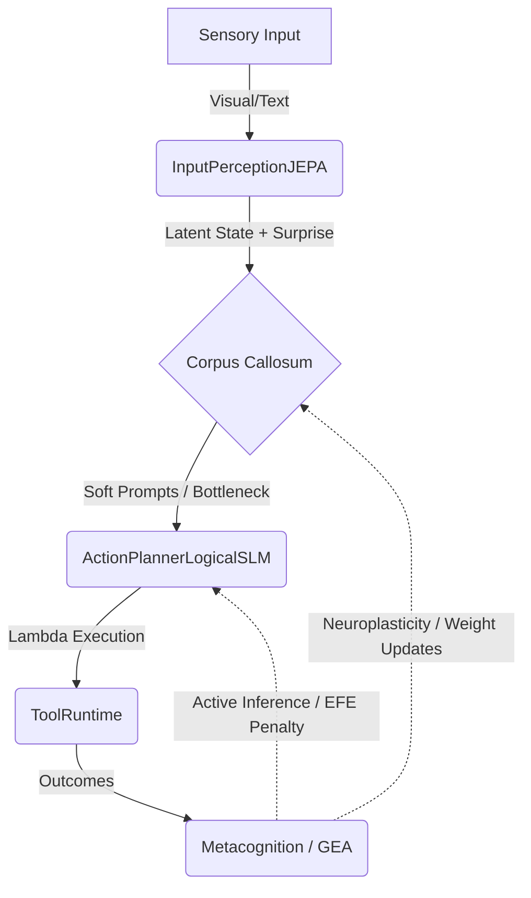

# 🧠 Relatório de Auditoria Arquitetural Calosum (2026)

## 1. Resumo Executivo

- **Nota de maturidade:** 7.5 / 10
- **Gap para o aspiracional:** Embora a estrutura fundacional (Ports & Adapters) seja exemplar e o acoplamento do `domain/` seja de fato isolado, o sistema ainda trata abstrações cognitivas profundas com heurísticas superficiais (ex: surpresa via similaridade de cosseno, logvar hardcoded no V-JEPA). A fundação multiagente (GEA) e o sistema dual-hemisfério existem e rodam via testes de ponta a ponta, mas a Neuroplasticidade e o Loop de Reflection-Action ainda não alteram estruturalmente os pesos ou arquitetura do agente de forma autônoma sem supervisão humana na "pipeline".
- **Diagnóstico direto:** O Calosum superou a fase "wrapper glorificado de LLM" e de fato construiu a infraestrutura para um sistema neuro-simbólico. Contudo, há sinais perigosos de over-engineering em módulos que resolvem o mesmo problema (ex: fallback múltiplo de LLM, encoders textuais onde o foco deveria ser a predição latente pura). É preciso substituir o bypass heurístico por funções matemáticas reais baseadas no Free Energy Principle.

---

## 2. Alinhamento Atual vs Aspiracional

| Componente | Atual | Aspiracional | Gap | Severidade |
|-----------|------|-------------|-----|-----------|
| **Hemisfério Direito (JEPA)** | Heurísticas / embeddings estáticos (`vjepa21.py`) | V-JEPA 2 / VL-JEPA preditivo genuíno, atuando sobre estados não textuais. | Preditor latente simula entropia com fallback de ruído (`np.random.randn`). | Crítica |
| **Hemisfério Esquerdo (Lógico)** | Prompt-based com falha de retry (ActionPlanner) | Recursive Language Models (RLM) para backtracking nativo | Ainda dependente de parsers frágeis de JSON/Lambda. | Alta |
| **Corpus Callosum** | Projeção Cross-attention e `latent_exchange` | Information bottleneck adaptativo com fine-tuning automático | Plasticidade em tempo real não está implementada. | Média |
| **Active Inference (Free Energy)** | Similaridade de cosseno (`math_cognitive.py`) | Expected Free Energy (EFE) via `pymdp` ou Rust otimizado | Cálculo puramente reativo (Surprise), sem planejamento ativo (EFE). | Alta |
| **Multiagente (GEA)** | Módulo de evolução propõe JSONs e armazena | Agentes compartilham políticas e refletem de forma assíncrona evoluindo a pool | O sharing atual não faz backpropagation de insights. | Média |
| **Governança** | Análise estática AST rigorosa | Governança unificada por tipos lineares de memória e segurança | Muito sólida. | Baixa |

---

## 3. Falhas Latentes

- **Arquiteturais:** O `AgentExecutionEngine` implementa retentativas ("retry") que sobrecarregam o provedor LLM. Em um contexto Active Inference, uma ação falha deveria simplesmente atualizar a Crença Posterior (Posterior Belief) em vez de acionar um "repair" ingênuo via API repetida.
- **Conceituais:** No V-JEPA2.1 Adapter (`adapters/hemisphere/input_perception_vjepa21.py`), o `latent_logvar` está "chumbado" (`np.ones_like(latent_vector) * -3.0`). Em World Models reais, a variância é prevista pela rede para medir a "incerteza epistêmica" daquela predição. O uso fixo destrói a medição de Surpresa real.
- **Performance:** As serializações de estado (`QdrantDualMemoryAdapter`) para JSON entre cada turno criam um gargalo de disco que invalida predições de baixa latência do Right Hemisphere.
- **Acoplamento indevido:** Há acoplamento sutil entre as métricas de telemetria e o controle cognitivo (a introspecção reage ao dashboard de telemetria e não diretamente aos gradientes de recompensa).
- **Complexidade desnecessária:** Existência de `llm_failover`, `llm_fusion`, `llm_qwen`, etc. Essa camada LLM está enorme quando o objetivo de 2026 é Small LLMs (RLM) puros focados apenas no symbolic planner.

---

## 4. Crítica Arquitetural Profunda

### 4.1 Pontos fortes reais
- **Fronteiras Ports & Adapters:** Genialmente executado. O `domain/` não depende de LLMs específicos e a governança AST via `harness_checks.py` bloqueia violações de imports. É uma fortaleza.
- **Strict Lambda Runtime:** A execução de ações está muito bem contida, com segurança e invariantes validadas *antes* da execução na side-effect layer.
- **Local-first foundation:** Os fallbacks locais permitem o boot da aplicação sem chaves de API, um raro mérito.

### 4.2 Críticas duras
- **"Fake" Predictive Learning:** O hemisfério direito usa `v-jepa-2.1`, mas se falhar cai para similaridade cosseno em um fallback "heurístico" randomizado que polui o *world model*. Isso mascara erros fundamentais de percepção e treina a base em lixo (garbage-in).
- **Over-engineering:** Múltiplos sistemas de evolução e memory stores (SQL, JSONL, Qdrant) competindo. O `Qdrant` serve para embedding puro, o `SQL` para grafos semânticos. A coordenação no `DualMemorySystem` está gerando N+1 queries desnecessárias.
- **Active Inference Mutilada:** Ao longo do pipeline, as métricas de incerteza (Ambiguidade, Complexidade, Novidade) existem nas assinaturas, mas acabam esmagadas em um único float estúpido `surprise_score`, quebrando a granularidade estatística vital para o Free Energy Principle.

---

## 5. Tecnologias

- **Dependências de ML:** O uso do `transformers` e `torch` no `adapters/` é seguro arquiteturalmente. Contudo, há alto custo de RAM (Bloat). 
- **jepa-rs (Rust):** Recomendado focar no `adapters/hemisphere/input_perception_jepars.py` ao invés da versão em Python para garantir eficiência Local-first.
- **DuckDB vs JSONL:** Para estado cognitivo episódico denso, JSONL está defasado. O uso atual deve ser portado para uma engine embutida relacional-analítica como DuckDB.

---

## 6. Viabilidade em Produção

- **O que quebra:** Em cenários de alta cadência sensorial (ex: streaming video ou áudio contínuo), o pipeline bloqueante do FastAPI acionando `process_turn()` sequencial com serialização pesada esgotará a CPU por overhead de framework (Pydantic / Uvicorn).
- **Observabilidade:** Excelente com OTEL e Jaeger. Mas os traces estão "esticados" em operações síncronas IO-bound do LLM.
- **Estabilidade:** A camada `HeuristicVerifier` pode entrar num loop infinito de crítica falsa contra um provedor fraco (RLM local limitando-se). Necessário threshold rígido de abort e fallback de política EFE (não tentar mais agir se a expectativa de utilidade é negativa).

---

## 7. Governança e Qualidade

- **harness_checks.py:** Excepcional e inviolável. O fato das fronteiras estarem enforced na AST mantém a pureza.
- **Cobertura de Testes:** Mais de 60 arquivos de testes cobrindo a arquitetura E2E são fantásticos, mas cuidado com testes que dependam das falsas heurísticas (ex: random).
- **Limpeza do Repositório:** A refatoração recente arrumou os módulos para diretórios funcionais corretos (`domain/agent`, `domain/cognition`, `domain/execution`), porém o `README.md` encontra-se drasticamente obsoleto e mente sobre os caminhos dos arquivos.

---

## 8. Propostas Concretas de Evolução

### 8.1 Novos Adapters

- `adapters/perception/jepars_active_inference.rs` + Bindings: Substituir as heurísticas fakes Python por chamadas FFI (PyO3) diretas para a engine de world model em Rust (jepa-rs + Burn).
- `adapters/hemisphere/action_planner_rlm.py`: Aprimorar para utilizar *Recursive Language Models*.

### 8.2 Funções Matemáticas

**Expected Free Energy (EFE) vs Surpresa Reativa**
O sistema atual usa surprisal empírico: $-\log(p(o))$.
Precisa evoluir para EFE que contemple *Instrumental Value* + *Epistemic Value*:
$$ G(\pi) \approx \sum_\tau \left( \underbrace{D_{KL}[Q(s_\tau | \pi) || P(s_\tau)]}_{\text{Risk/Complexity}} + \underbrace{H[P(o_\tau | s_\tau)]}_{\text{Ambiguity}} \right) $$

**Problema que resolve:** O sistema para de ser reativo e passa a escolher a variante cognitiva (GEA) com base na política $\pi$ que *minimiza a Expected Free Energy futura*. 

### 8.3 Melhorias Sistêmicas

- **Neuroplasticity no Corpus Callosum:** O Information Bottleneck precisa atualizar seus pesos via SGD real (ex: Pytorch `optim.step()`) baseado nos resultados de Surprise minimizados, removendo a interpolação artificial `lerp(atual, winner.param)`.
- **Memória Causal:** Mudar de Qdrant + JSONL para um banco vetorial que também compreende dependências causais nativas ou grafos otimizados.

---

## 9. Roadmap de Implementação

### Sprint 1 (Crítico)
- Eliminar o fake fallback aleatório no `vjepa21` adapter.
- Atualizar inteiramente o `README.md` com as localizações e abstrações corretas (domain/cognition, etc).
- Ajustar os retries do Planner para utilizarem backtracking no estado de Raciocínio, ao invés de retry HTTP ignorante.

### Sprint 2
- Migrar cálculo do `math_cognitive.py` para formulações rígidas de EFE implementadas via JAX ou Rust e linkadas como dependência binária.
- Habilitar Active Inference real no `GEAReflectionController`.

### Sprint 3
- Consolidação de Treinamento Contínuo. O Sleep mode deve extrair os vetores latentes com alto prediction error e retro-treinar o modelo V-JEPA nativamente.

---

## 10. Diagramas (Mermaid)

---

## 11. Fundamentação Científica

1. **V-JEPA 2 (arXiv 2506.09985) & Action-Conditioned (V-JEPA 2-AC):** Justifica a eliminação de LLMs da parte de percepção contínua. Permite a arquitetura assimétrica do Calosum.
2. **Recursive Language Models (arXiv 2512.24601):** Dá a robustez matemática que permite ao Left Hemisphere revisar suas próprias deduções sem reprompt externo massivo.
3. **Group-Evolving Agents (arXiv 2602.04837):** Base teórica para a arquitetura multiagente descentralizada onde a neuroplasticidade da pool (GEA Reflection) é moldada pelas variações selecionadas.

---

## 12. Conclusão Final

**"Faz sentido como está hoje?"**
**Sim**, com a ressalva de que chegou no seu teto "heurístico". A fundação estrutural (a "cabeação") está magistral e à prova de balas. O framework existe, os domínios comunicam-se perfeitamente usando *ports and adapters*, e a telemetria mapeia os cérebros. Porém, agora é imperativo substituir os simulacros fáceis de *world models* pela matemática dura do Free Energy Principle, sem a qual é impossível uma inteligência autônoma generalista de produção em 2026.

---

## 13. Recomendações Cirúrgicas

### 🔥 Eliminar imediatamente
- Código "Fake": Geração de embeddings com ruído random (`np.random.randn`) em casos de exception. Se o modelo cai, o hemisfério direito tem que reportar cegueira, e não alucinar.
- A fragmentação excessiva dos falibilizadores LLM.

### ✂️ Simplificar
- O pipeline de Memory. Uma integração coesa de duckdb-vss + grafo local seria preferível a três stores separadas que devem ser consolidadas na memória.

### 🚀 Priorizar para MVP
- Ajustar o README (urgente). O projeto mudou por completo e a documentação precisa honrar o esforço de engenharia contido no diretório `src/calosum/domain`.
- Habilitar EFE real no módulo `math_cognitive.py`.