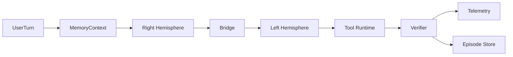
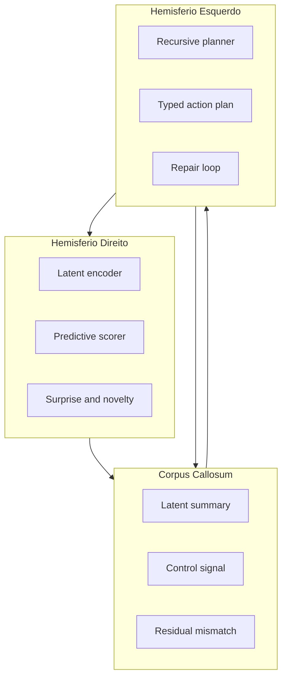

# 2026-04-03 Calosum Architecture Review Dual Hemisphere Reality Check

## Purpose

Registrar uma revisao arquitetural completa, critica e tecnicamente agressiva do estado real do Calosum em 2026-04-03, confrontando o codigo implementado com o alvo aspiracional de um framework dual-hemisphere local-first com world model preditivo, raciocinio recursivo, active inference operacional e multiagentes com experiencia compartilhada.

## Scope

- Codigo inspecionado em `src/calosum/`, `tests/`, `ui/`, `.github/workflows/ci.yml`, `pyproject.toml`, `requirements.txt`, `README.md` e `docs/`.
- Componentes avaliados: orchestrator, runtime, bridge, hemisferio direito, hemisferio esquerdo, memoria, night training, telemetria, governanca, UI e CI.
- Esta revisao nao altera o codigo existente. O unico artefato criado neste trabalho e este relatorio.

## Validation

Comandos executados durante a revisao:

- `PYTHONPATH=src ./.venv/bin/python3 -m calosum.harness_checks`
- `PYTHONPATH=src ./.venv/bin/python3 -m unittest discover -s tests -t .`
- `cd ui && npm run lint`
- `cd ui && npm run build`

Resultados observados:

- `harness_checks`: passou.
- Testes Python: `172` executados, `1` falha e `6` erros.
- UI: lint passou; build passou.
- CI declarado em `.github/workflows/ci.yml` referencia scripts em `scripts/` que nao existem no repositorio.

## Progress

- [x] Documentacao obrigatoria revisada.
- [x] Wiring, ports, adapters e governanca revisados.
- [x] Runtime, memoria, bridge, reflection, night training e telemetria revisados.
- [x] Suite de testes e UI validadas.
- [x] Relatorio consolidado em artefato versionado.

## Decision Log

- Este artefato foi salvo diretamente em `docs/exec-plans/completed/` porque o trabalho solicitado era um relatorio concluido, nao uma mudanca arquitetural em execucao.
- Nenhum arquivo previamente modificado foi tocado. O repositorio ja estava sujo e foi preservado.
- O tom deliberadamente evita diplomacia: o objetivo aqui e cortar narrativa, nao protege-la.

## 1. Resumo Executivo

- **Nota de maturidade:** `4.2/10`
- **Gap para o aspiracional:** muito alto
- **Diagnostico direto:** hoje o Calosum nao e um framework dual-hemisphere maduro. Ele e um framework de agente com runtime de tools razoavelmente real, memoria local suficiente para um scaffold de pesquisa, governanca estrutural util e uma camada de nomenclatura cognitiva muito acima da substancia implementada.

O sistema tem base de engenharia em `Ports and Adapters`, algum controle de contratos e uma UI funcional. Isso e real. O problema e o resto: o "world model" nao sustenta o nome, o "RLM" e um chunker recursivo com fallback textual, o `GEAReflectionController` esta praticamente morto no caminho principal, a neuroplasticidade e no-op, o sleep mode exporta dataset mas nao fecha um loop de aprendizagem confiavel, e os backends JEPA mais ambiciosos quebram na pratica.

Se a pergunta for "isto ja e um aspiracional dual-hemisphere local-first de 2026?", a resposta e simples: nao. Se a pergunta for "ha um nucleo de runtime e governanca sobre o qual isso pode ser reconstruido sem jogar tudo fora?", a resposta e sim.

## 2. Alinhamento Atual vs Aspiracional

| Componente | Atual | Aspiracional | Gap | Severidade |
|-----------|------|-------------|-----|-----------|
| Hemisferio Direito | Mistura de heuristicas, embeddings e adapters experimentais; `vjepa21` e `jepars` quebram em testes | World model preditivo local, calibrado, multi-horizonte e action-conditioned | Enorme | Critica |
| Hemisferio Esquerdo | `QwenLeftHemisphereAdapter` funcional + `RlmLeftHemisphereAdapter` que faz chunk/compose | RLM real com recursao verificavel, custo/budget e traces | Alto | Alta |
| Corpus Callosum | `ContextCompressor` analitico com tokens `<latent_dim:n>`; cross-attention opcional e nao treinado | Bridge neural bidirecional com residuals e aprendizado offline | Alto | Alta |
| GEA / Reflection | Controller existe, mas o pipeline principal nao brancha; persona default e unica; neuroplasticidade e no-op | Branching real, experiencia compartilhada, selecao por custo/efeito | Enorme | Critica |
| Active Inference | Wrapper de score sobre `surprise`, `ambiguity` e `KL`; sem politica nem controle epistemico real | Selecionador de politicas com risco, ambiguidade, epistemic value e custo de acao | Alto | Alta |
| Memoria | Episodica + regras + grafo + persistencia local/Qdrant; sleep mode consolida regras e datasets | Memoria operacional, semantica e de treino claramente separadas e versionadas | Medio | Media |
| Night Training | DSPy heuristico/compilador; LoRA desativado por seguranca | Aprendizado offline versionado, avaliavel e aplicavel sob gate humano | Alto | Alta |
| Runtime / "StrictLambda" | Runtime de tools e wrappers contratuais sao reais; "StrictLambdaRuntime" como classe nao existe | Runtime formal com AST tipado, politica de permissao e feedback ao world model | Medio | Media |
| Telemetria | JSONL/OTLP local e sink HTTP sincrono best-effort | OTEL robusto, assinado, assinc, com collector endurecido | Medio | Media |
| Governanca | Harness AST real, mas sem semantica nem coerencia docs-codigo | Harness que proibe drift semantico e narrativo | Medio | Alta |
| CI e Benchmarks | Workflow existe; scripts de gate ausentes; baseline trivial | CI executavel, gates relevantes e benchmarks representativos | Alto | Critica |
| UI | Dashboard compila e apresenta estado/telemetria | UI refletindo arquitetura real, nao narrativa aspiracional | Medio | Media |

## 3. Falhas Latentes

### Arquiteturais

- O repositorio declara uma arquitetura maior do que implementa. `docs/ARCHITECTURE.md` descreve arquivos e modulos que nao existem mais ou nunca existiram, incluindo nomes como `left_hemisphere.py`, `right_hemisphere.py`, `runtime.py`, `persistent_memory.py` e `group_turn.py`.
- O controller de reflexao existe como objeto injetado, mas o `orchestrator` executa fluxo linear e nao chama `evaluate()` no caminho principal.
- O `self_model` e a documentacao continuam narrando group turns e reflection como se fossem ativos. Isso e drift semantico, nao detalhe.
- O bridge esta no dominio, mas sua parte "neural" depende de um adapter com pesos aleatorios nao treinados. Resultado: acoplamento de narrativa de aprendizagem com implementacao essencialmente estatica.

### Conceituais

- O projeto usa "world model" para se referir a adapters que, em parte importante do tempo, fazem embeddings de texto ou vetores randomicos. Isso nao e world modeling.
- O `RlmLeftHemisphereAdapter` nao implementa o que o paper de RLM vende. Ele faz decomposicao textual por chunk, opcionalmente chama um binario, e recompõe saidas. Isso e scaffolding recursivo, nao um RLM convincente.
- O `GEAReflectionController` usa EFE para escolher candidatos, mas o sistema gera um candidato unico por padrao. Otimizacao sobre conjunto unitario e teatro.
- A neuroplasticidade e declarada em `ports.py`, narrada em docs, testada como no-op seguro, e ausente como mecanismo adaptativo real.

### Performance

- `input_perception_vjepa21.py` instancia `SentenceTransformer("all-MiniLM-L6-v2")` dentro de `_text_to_latent()` em tempo de chamada. Isso e custo explosivo por request.
- O adapter V-JEPA usa prototipos emocionais gerados com `np.random.randn` em `_decode_emotions()`. Isso gera comportamento nao deterministico para um componente supostamente cognitivo.
- O exporter OTLP HTTP e sincrono no caminho quente. Em carga, isso vira latencia e acoplamento operacional.
- A estrategia atual multiplica adaptadores e dependencias antes de endurecer um backend estavel. Isso aumenta custo cognitivo da equipe e custo computacional do sistema.

### Escalabilidade Cognitiva

- Nao existe branching cognitivo operacional. O sistema nao escala deliberação; ele escala nomenclatura.
- Experience sharing existe em adapters e stores, mas nao ha scheduler nem politica principal que consuma isso como mecanismo central de decisao.
- O sleep mode exporta artefatos, mas nao existe trilha robusta de aplicacao, reversao, comparacao e invalidacao de artefatos aprendidos.

### Acoplamento Indevido

- `ContractEnforced*` wrappers escondem falhas reais ao normalizar tudo. Isso melhora robustez superficial, mas piora honestidade diagnostica.
- O sistema de introspecao conhece detalhes demais do builder, das capabilities e do wiring. Isso vaza implementacao pela camada reflexiva.
- A governanca AST protege fronteiras de import, mas nao protege fronteiras semanticas. O resultado e um repositorio estruturalmente limpo e semanticamente inconsistente.

### Complexidade Desnecessaria

- Muitos backends do hemisferio direito para pouca confiabilidade.
- Fusion no hemisferio esquerdo antes de estabilizar o hemisferio direito.
- LoRA narrado em docs e roadmap, mas desligado por seguranca no caminho real.
- Benchmark gate baseado em `tool_success_rate = 1.0` num baseline mockado. Isso e um numero cosmetico.

### Falhas Nao Obvias

- `calculate_surprise()` em `shared/utils/math_cognitive.py` pode produzir valor negativo porque inclui `predicted_logvar` diretamente; isso ja estourou na pratica e gerou `surprise_score < 0.0`.
- `input_perception_vjepa21.py` usa `confidence = 1.0 - surprise`. Quando `surprise` fica negativo, `confidence` pode passar de `1.0`. Isso derrubou testes e o E2E.
- `CrossAttentionBridgeAdapter.train_step()` chama atualizacao manual em `self._W_q.data` etc.; como `nn.Linear` e modulo, nao tensor, a rotina cai no `except` e retorna `0.0`. O caminho de treino parece existir, mas e morto.
- O adapter `jepars` assume Arrow IPC perfeito e falha duro quando o formato real diverge minimamente. Nao ha negociacao de schema.
- O CI declara gates de cobertura e benchmark, mas os scripts referenciados nao existem. A percepcao de governanca e maior que a governanca real.

## 4. Critica Arquitetural Profunda

### 4.1 Pontos fortes reais

- **Ports and Adapters de verdade:** a separacao `shared -> domain -> adapters -> bootstrap` existe e tem enforcement util.
- **Runtime de tools funcional:** o `ConcreteActionRuntime` tem registro, validacao de payload, estados `executed/rejected/needs_approval` e alguma auditabilidade.
- **Fallbacks pragmatos:** memoria, embeddings e LLM têm rotas de degradacao razoaveis para um scaffold local.
- **Persistencia local util:** JSONL/SQLite/Qdrant cobrem um ciclo de prototipo local-first sem depender de cloud para existir.
- **UI nao esta quebrada:** ela compila, linta e entrega um painel funcional.
- **Harness structural control:** apesar de limitado, o harness impede drift estrutural bruto.

### 4.2 Criticas duras

- **Over-engineering frontal:** o sistema tem mais "tipos de cerebros" do que uma equipe pequena consegue endurecer. Isso mata maturidade.
- **Inconsistencia narrativa:** docs, roadmap, README e codigo contam historias diferentes. O repositorio esta vendendo um produto que o runtime nao entrega.
- **Fragilidade numerica:** o pipeline perceptivo consegue gerar estados invalidos que quebram a API. Em um suposto framework cognitivo, isso e desqualificante.
- **Baixa coesao semantica:** o runtime e uma base de agent tooling; a camada cognitiva e um overlay terminologico irregular em cima disso.
- **Alto acoplamento operacional:** telemetria, introspecao, reflection, memory e builder se conhecem demais.
- **Componentes sem sentido pratico hoje:** `GEAReflectionController` sem branching, `apply_neuroplasticity()` vazio, bridge "learned" sem treino, LoRA "entregue" mas desligado, CI "com gates" sem scripts.
- **Foco errado de complexidade:** o sistema tentou pular de scaffold local para aspiracao FAIR-style sem antes provar um backend hemisferico estavel.

## 5. Tecnologias

### Dependencias

- `pyproject.toml` e `requirements.txt` carregam um stack grande demais para o nivel de maturidade real.
- Dependencias como `lightgbm`, `python-telegram-bot`, `nano-graphrag`, `dspy` e `qdrant-client` entram cedo demais no core da distribuicao.
- O `requirements.txt` fixa `torch`, `transformers`, `sentence-transformers` e outros pacotes pesados como baseline geral. Isso contradiz um posicionamento enxuto de local-first.

### Custo Computacional

- O custo do lado direito esta mal desenhado: carregar embeddings por request e misturar heuristica com modelos pesados torna latencia e memoria imprevisiveis.
- Cross-attention com pesos randomicos adiciona custo sem garantia de valor.
- Telemetria HTTP sincrona adiciona custo no caminho principal.

### Seguranca

- O runtime inclui `execute_bash`, `write_file`, `http_request`, `mcp` e `subordinate_agent`. Isso exige uma politica de permissao extremamente seria; hoje o foco de seguranca esta mais no contrato da acao do que na superficie operacional combinada.
- Segredos entram por env/vault simples. Isso e aceitavel para prototipo local, nao para operacao mais seria.

### Compatibilidade Local-First

- O projeto ainda e local-first em espirito para memoria e runtime, mas nao em maturidade. O default operacional ainda orbita endpoints compativeis OpenAI e dependencias pesadas locais mal endurecidas.
- O melhor caminho local do sistema hoje nao e V-JEPA nem RLM real; e um runtime de tools com LLM compatibilizado e percepcao simplificada.

### Bloat vs Necessidade

- Bloat alto. A pilha de pesquisa esta grande demais para a qualidade de integracao que ela tem.
- A ordem deveria ter sido: 1 backend direito estavel, 1 backend esquerdo estavel, 1 bridge honesta, 1 reflection simples. O repositorio fez o oposto.

## 6. Viabilidade em Producao

### O que quebra

- O backend atual quebra no caminho E2E local com `vjepa21`.
- O caminho CLI `run-scenario` falha.
- Um teste de API retorna `500`.
- `jepars` quebra ao parsear Arrow.
- Reflection, neuroplasticidade e branching nao sustentam as garantias narradas.

### Gargalos

- Modelo de embedding carregado em request path.
- Telemetria OTLP sincrona.
- Execucao serial de actions.
- Muitas camadas de normalizacao e fallback escondendo custo e atrasando diagnostico.

### Riscos de Seguranca

- Runtime poderoso demais para um motor cognitivo que ainda nao prova estabilidade decisoria.
- Permissoes de shell/escrita/rede existem, mas o sistema de veredito cognitivo ainda e fraco demais para autorizar agressivamente.
- Falta uma politica mais formal de provenance entre "modelo sugeriu" e "runtime executou".

### Estabilidade

- O sistema e estavel como scaffold de agent runtime.
- O sistema nao e estavel como arquitetura cognitiva avancada.
- Os wrappers mascaram erro demais. Isso reduz crash rate local, mas infla percepcao de confiabilidade.

### Observabilidade

- A telemetria local JSONL e util.
- O exportador OTLP externo ainda nao e endurecido.
- O sistema observa eventos; nao observa bem causalidade, backlog, saturacao, custo por componente e confianca calibrada em nivel de sistema.

## 7. Governanca e Qualidade

### `harness_checks.py`

- Ponto forte: garante artefatos obrigatorios, tamanho de modulo e fronteiras de import.
- Ponto fraco: o proprio arquivo tem `577` linhas, acima do limite que ele impõe aos demais.
- Ponto cego: nao detecta mentira arquitetural. Nao valida se arquivos citados em docs existem, se scripts de CI existem, se itens marcados como concluidos foram de fato entregues.

### Cobertura de Testes

- Volume de testes e bom para um scaffold.
- Qualidade de varios testes e insuficiente para sustentar claims arquiteturais.
- O teste de reflection valida basicamente "single candidate" e "noop seguro". Isso protege placeholder, nao comportamento.

### CI/CD

- O workflow existe.
- Os gates descritos nao sao confiaveis porque dependem de scripts ausentes:
  - `scripts/coverage_gate_new_modules.py`
  - `scripts/ci_integration_benchmark.py`
  - `scripts/ci_benchmark_gate.py`
- Benchmark baseline com `tool_success_rate = 1.0` em ambiente mockado nao serve como prova de maturidade.

### Organizacao do Codigo

- Organizacao macro boa.
- Nomes de componentes e arquivos ficaram desalinhados da implementacao.
- O repositorio precisa de uma rodada de "reality protocol": nomes honestos, flags honestas, docs honestas.

### Higiene do Repositorio

- Higiene estrutural melhor que a semantica.
- Roadmap e docs ainda carregam itens como entregues que hoje nao sustentam auditoria tecnica.

## 8. Propostas Concretas de Evolucao

### 8.1 Novos Adapters

Adote nomes canonicos e preserve os atuais apenas como shims temporarios:

- `src/calosum/adapters/hemisphere/right_hemisphere_vjepa2.py`
  - Problema que resolve: substitui o adapter atual, que mistura fallback textual, pesos possivelmente ausentes e numerica quebrada.
  - Melhoria: um unico adapter serio para checkpoint local/ONNX com esquema de output estavel e metricas calibradas.

- `src/calosum/adapters/hemisphere/right_hemisphere_jepars.py`
  - Problema que resolve: parser Arrow fragil e sem negociacao.
  - Melhoria: handshake de schema, fallback para JSON e validacao explicita de protocolo com `version`.

- `src/calosum/adapters/hemisphere/left_hemisphere_rlm.py`
  - Problema que resolve: o adapter atual nao diferencia chunking de raciocinio recursivo propriamente dito.
  - Melhoria: runtime RLM com trace de recursao, custo por chamada, budget de profundidade e retorno estruturado por subproblema.

- `src/calosum/adapters/bridge/neural_bidirectional_bridge.py`
  - Problema que resolve: bridge atual so empurra heuristica do direito para o esquerdo.
  - Melhoria: residual de discordancia esquerda->direita, gating treinavel offline e signal packing mais honesto que `<latent_dim:n>`.

### 8.2 Funcoes Matematicas

#### Refined Expected Free Energy

Proposta:

```text
G(pi) = sum_t gamma^(t-1) * [
    lambda_r * KL(q(s_t|pi) || p_pref(s_t))
  + lambda_a * H[p(o_t|s_t)]
  - lambda_i * I_q(s_t ; o_t | pi)
  + lambda_c * Cost(a_t)
]
```

- Problema que resolve: hoje o sistema reduz EFE a `risk + ambiguity`, o que nao distingue exploracao epistemica de custo de acao.
- Por que melhora: permite branching apenas quando o valor epistemico supera custo e risco operacional.

#### Variational Free Energy com Novelty Weighting

Proposta:

```text
F_t* = KL(q(s_t) || p(s_t|m)) - E_q[log p(o_t|s_t,m)] + lambda_n * D_novel(q(s_t), q_hist)
```

Onde `D_novel` pode ser uma divergencia contra densidade historica local.

- Problema que resolve: o score atual mistura surpresa e salience sem separar erro preditivo de novidade contextual.
- Por que melhora: permite usar novelty como gatilho de consolidacao/plasticidade sem contaminar a confianca basal.

#### Surprise Metric Moderna

Proposta:

```text
S_t = alpha * NLL_t + beta * TempInconsistency_t + delta * CalibrationError_t
```

- Problema que resolve: a funcao atual pode ficar negativa e nao calibra confianca.
- Por que melhora: evita estados invalidos e conecta surpresa a previsao temporal, nao so a uma gaussiana diagonal simplificada.

#### Hierarchical Latent Prediction

Proposta:

```text
z_t = { z_t_coarse, z_t_mid, z_t_fine }
```

Com previsao por horizonte:

```text
hat{z}_{t+h}^k = f_k(z_t^k, a_t, m_t),  k in {coarse, mid, fine}
```

- Problema que resolve: um unico vetor latente hoje tenta carregar afeto, risco, semantica e affordance.
- Por que melhora: separa planejamento de alto nivel, dinamica local e sinal afetivo/contextual.

### 8.3 Melhorias Sistemicas

#### Bridge neural

- Tornar o bridge bidirecional.
- Persistir nao apenas configuracao, mas tambem residuals de discordancia e historico de erro.
- Remover o rótulo "learned" enquanto o treino nao estiver realmente conectado.

#### Neuroplasticity

- Tirar do caminho online.
- Mover para loop offline com gate humano ou benchmark gate automatico.
- Persistir proposta, avaliacao e rollout; nunca aplicar tuning cego no turno seguinte.

#### GEA ReflectionController

- Reativar branching so com:
  - `reflection_enabled`
  - budget
  - threshold epistemico
  - metricas comparaveis
- Score de selecao deve incluir:
  - task success
  - runtime safety
  - epistemic gain
  - cost
  - latency budget

#### Sistema de memoria

- Separar:
  - memoria de execucao
  - memoria de conhecimento
  - corpus de treino
  - artefatos compilados
- Nao reaproveitar episodios brutos como dataset de treino sem dedupe, saneamento e lineage.

## 9. Roadmap de Implementacao

### Sprint 1 (critico)

Objetivo: parar de quebrar e parar de mentir.

Entregas:

- Desabilitar `vjepa21`, `vljepa` e `jepars` por default atras de flag experimental.
- Corrigir `calculate_surprise()` para nunca produzir score fora de `[0,1]`.
- Remover claims de GEA/neuroplasticidade/sleep learning como recursos ativos enquanto forem placeholders.
- Corrigir ou remover jobs de CI que dependem de scripts inexistentes.
- Adicionar teste de coerencia docs-codigo ao harness.

Codigo de exemplo:

```python
def clamp01(value: float) -> float:
    return max(0.0, min(1.0, value))

surprise = clamp01(raw_surprise)
confidence = clamp01(base_confidence * (1.0 - 0.5 * surprise))
```

Novas env vars:

- `CALOSUM_RIGHT_ENABLE_EXPERIMENTAL=0`
- `CALOSUM_REFLECTION_ENABLED=0`
- `CALOSUM_TELEMETRY_MODE=jsonl`

Testes necessarios:

- `tests/adapters/perception/test_efe_math.py`
- `tests/bootstrap/test_api.py`
- `tests/integration/test_pipeline_dual_hemisphere_e2e.py`
- novo `tests/test_docs_reality.py`

### Sprint 2

Objetivo: substituir placeholders por mecanismos honestos.

Entregas:

- Introduzir adapter canonico `right_hemisphere_vjepa2.py`.
- Introduzir `left_hemisphere_rlm.py` com trace recursivo real.
- Introduzir `neural_bidirectional_bridge.py` com treino offline real ou manter bridge analitico e assumir isso explicitamente.
- Reativar reflection com `branch_width <= 3` e budget formal.

Codigo de exemplo:

```python
@dataclass(slots=True)
class PolicyScore:
    risk: float
    ambiguity: float
    info_gain: float
    action_cost: float

    @property
    def efe(self) -> float:
        return self.risk + self.ambiguity - self.info_gain + self.action_cost
```

Novas env vars:

- `CALOSUM_RIGHT_BACKEND=hf|vjepa2|jepars`
- `CALOSUM_ACTIVE_INFERENCE_HORIZON=4`
- `CALOSUM_REFLECTION_BRANCH_WIDTH=3`
- `CALOSUM_BRIDGE_BACKEND=analytic|neural_bidirectional`

Testes necessarios:

- novo `tests/adapters/hemisphere/test_right_hemisphere_vjepa2.py`
- novo `tests/adapters/hemisphere/test_left_hemisphere_rlm_runtime.py`
- novo `tests/domain/metacognition/test_reflection_branching.py`

### Sprint 3

Objetivo: fechar o loop offline e tornar GEA/memoria uteis.

Entregas:

- Experience sharing consumido de fato na selecao de variantes.
- Sleep mode com datasets versionados, dedupe e artifact registry.
- Aplicacao de artefatos apenas sob benchmark gate.
- Exportador OTLP assinc e endurecido.

Codigo de exemplo:

```python
artifact = trainer.run_training_cycle()
if artifact["status"] == "success" and benchmark_gate.accepts(artifact):
    artifact_store.promote(artifact)
```

Novas env vars:

- `CALOSUM_SLEEP_TRAINER_BACKEND=dspy|disabled`
- `CALOSUM_SLEEP_APPLY_ARTIFACT=0|1`
- `CALOSUM_OTLP_EXPORT_MODE=async`
- `CALOSUM_GEA_EXPERIENCE_MIN_SUPPORT=25`

Testes necessarios:

- novo `tests/adapters/night_trainer/test_artifact_promotion.py`
- novo `tests/adapters/experience/test_reflection_uses_experience_store.py`
- novo `tests/integration/test_sleep_mode_benchmark_gate.py`

## 10. Diagramas (Mermaid)

### Pipeline cognitivo



### Arquitetura hemisferica



### Fluxo de Active Inference

```mermaid
flowchart TD
    O[Observation] --> Q[Posterior q(s)]
    Q --> P[Predict future states]
    P --> G[Compute G(pi)]
    G --> D{Epistemic gain > cost?}
    D -- yes --> A1[Epistemic action]
    D -- no --> A2[Task action]
    A1 --> O2[New observation]
    A2 --> O2[Outcome]
    O2 --> Q
```

## 11. Fundamentacao Cientifica

| Decisao | Paper | Qual problema resolve | Por que e superior | Limitacoes reais |
|---|---|---|---|---|
| Mover o hemisferio direito para world model latente real | *V-JEPA 2: Self-Supervised Video Models Enable Understanding, Prediction and Planning*, Mido Assran et al., 2025, arXiv:2506.09985 | Trocar embeddings/heuristicas por previsao latente orientada a planejamento | Usa predicao em espaco latente e demonstra utilidade para understanding, anticipation e planning | Video-first, custo alto, nao e drop-in para texto puro |
| Fazer a fusao multimodal em espaco latente em vez de autoregressivo token a token | *VL-JEPA: Joint Embedding Predictive Architecture for Vision-language*, Delong Chen et al., 2025, arXiv:2512.10942 | Evitar decodificacao pesada e alinhamento superficial entre modalidades | Embedding-space prediction reduz parametros e custo de decode | Ainda e preprint recente e exige decoder auxiliar quando texto final e necessario |
| Substituir o "RLM" atual por recursao verificavel | *Recursive Language Models*, Alex L. Zhang, Tim Kraska, Omar Khattab, 2025, arXiv:2512.24601 | Tratar prompts longos e decomposicao real de subproblemas | A recursao passa a ser mecanismo de inferencia, nao so chunking | Custo por chamada e orquestracao sobem rapido |
| Fazer experience sharing de verdade, nao so persistencia | *Group-Evolving Agents: Open-Ended Self-Improvement via Experience Sharing*, Zhaotian Weng et al., 2026, arXiv:2602.04837 | Aproveitar diversidade exploratoria em vez de isolar variantes | Grupos compartilham experiencia e melhoram eficiencia da evolucao | Muito caro se nao houver budget e pruning serio |
| Estruturar predicao latente hierarquica | *Self-Supervised Learning from Images with a Joint-Embedding Predictive Architecture*, Mahmoud Assran et al., 2023, arXiv:2301.08243 | Sair de um unico vetor que mistura tudo | JEPA foca invariancias sem reconstruir tudo no input space | Nao resolve sozinho controle temporal e acao |
| Introduzir prioridades epistemicas endogenas para idle foraging e observacao | *Telogenesis: Goal Is All U Need*, Zhuoran Deng et al., 2026, arXiv:2603.09476 | Trocar limiar fixo de surpresa por prioridades baseadas em ignorancia, surpresa e staleness | Gera objetivos observacionais internamente sem reward externo | E recente e ainda nao prova robustez de producao |
| Ancorar o desenho em JEPA hierarquico e modelos latentes, nao em geracao token a token para tudo | *Introduction to Latent Variable Energy-Based Models: A Path Towards Autonomous Machine Intelligence*, Anna Dawid, Yann LeCun, 2023, arXiv:2306.02572 | Dar base teorica a modelos latentes hierarquicos e world models | E uma moldura mais coerente para agentes que precisam prever e agir | Continua sendo direcao arquitetural, nao blueprint de implementacao |

Leitura correta desses papers:

- Eles justificam a direcao.
- Eles nao justificam os atalhos atuais do repositorio.
- O erro do Calosum hoje nao e ambicao demais; e declarar que ja percorreu o caminho.

## 12. Conclusao Final

> **"Faz sentido como esta hoje?"**

**Nao.**

Faz sentido como scaffold de agente local com runtime de tools, memoria e governanca estrutural. Nao faz sentido como framework dual-hemisphere aspiracional de 2026. O codigo principal nao sustenta os claims de world modeling, recursive reasoning, GEA, neuroplasticity e sleep learning no nivel em que sao narrados.

## 13. Recomendacoes Cirurgicas

### Eliminar imediatamente

- Claims de group turn/GEA/neuroplasticidade como recursos ativos.
- `vjepa21`, `vljepa` e `jepars` como caminhos default.
- Jobs de CI que apontam para scripts inexistentes.
- O rotulo "learned" para bridge sem treino conectado.
- Qualquer baseline de benchmark que use `tool_success_rate = 1.0` como prova util.

### Simplificar

- Reduzir hemisferio direito para:
  - `hf` estavel
  - `heuristic_jepa` fallback
  - `vjepa2` experimental
- Reduzir hemisferio esquerdo para:
  - `qwen/openai-compatible` estavel
  - `rlm` experimental
- Manter o bridge analitico ate existir treino offline real.
- Tirar LoRA do discurso ate voltar com benchmark gate serio.

### Priorizar para MVP

- Runtime de tools com contratos.
- Memoria local persistente.
- Telemetria JSONL confiavel.
- Hemisferio direito simples e honesto.
- Hemisferio esquerdo estavel.
- Bridge analitico explicito.
- Reflection sob feature flag, com budget e metricas.
