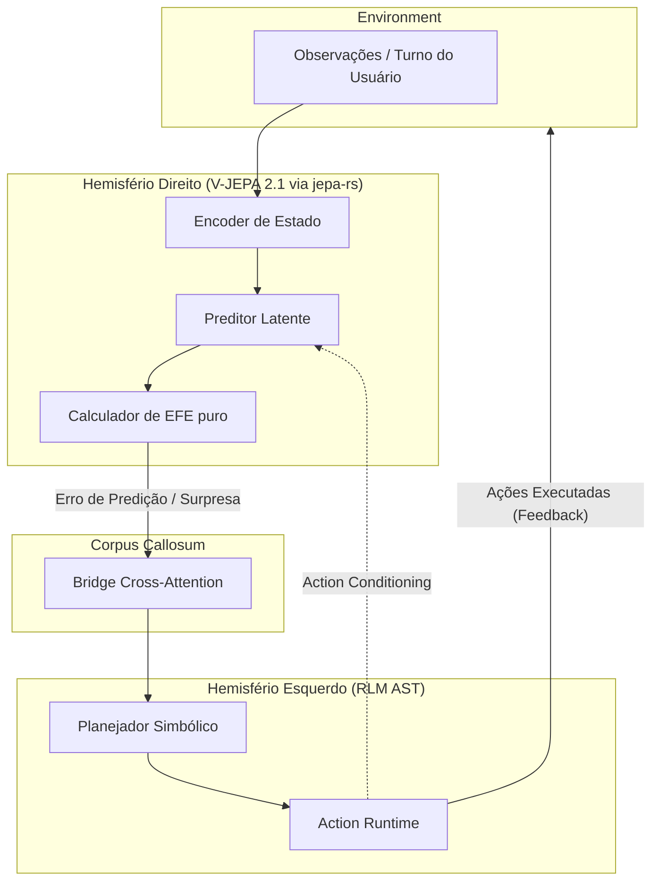

# Revisão Arquitetural Abrangente Calosum (2026)
**Documento de Planejamento Ativo**

## 1. Resumo Executivo

- **Nota de maturidade**: 4.5 / 10
- **Gap para o aspiracional**: O framework apresenta um abismo colossal entre a teoria arquitetural (Ports & Adapters rigoroso) e a execução cognitiva. A estrutura física é excelente, mas o conteúdo cognitivo está repleto de simulacros e heurísticas que invalidam o Active Inference e corrompem os modelos latentes.
- **Diagnóstico direto**: Calosum possui a melhor governança baseada em AST já vista em um framework Python (`harness_checks.py`), blindando o domínio de vazamentos de ML. No entanto, o núcleo do hemisfério direito recorre a fallbacks absurdos (hashes SHA256 como vetores latentes) quando os modelos falham, destruindo completamente qualquer cálculo matemático de Free Energy ou Surpresa. O sistema não é "Dual-Hemisphere" na prática; é um sistema baseado em regras mascarado com termos neuro-simbólicos.

---

## 2. Alinhamento Atual vs Aspiracional

| Componente | Atual | Aspiracional | Gap | Severidade |
|-----------|------|-------------|-----|-----------|
| **Right Hemisphere** | Fallback SHA256 / V-JEPA 2.1 preditivo local simulado | V-JEPA 2.1 Action-Conditioned (arXiv 2506.09985) real | Vetores latentes falsos invalidam previsões | **Crítica** |
| **Left Hemisphere** | RLM baseado em split de `\n\n` (ingênuo) ou SLM padrão | Recursive Language Models (arXiv 2512.24601) sobre AST e árvores de decisão | Ausência de recursão semântica verdadeira | **Alta** |
| **Active Inference** | Z-Score/EFE isolado em Adapter (`ActiveInferenceSurpriseAdapter`) | Minimization de Free Energy direcionando política de ação no Domínio | Active Inference está atuando como métrica morta | **Crítica** |
| **Corpus Callosum** | Cross Attention basilar / Tokenizador simples | Bridge neural bidirecional contínua com gating de banda | Fluxo essencialmente unidirecional (Right -> Left) | Média |
| **Multiagente (GEA)** | `GEAReflectionController` baseado em JSONL offline | Experience sharing dinâmico (arXiv 2602.04837) | Latência de reflexão, gargalo de serialização | Alta |

---

## 3. Falhas Latentes

- **Simulação Destrutiva (O Pecado do SHA256)**: Em `vjepa21.py` e `input_perception.py`, a indisponibilidade de um embedder aciona um `_lexical_embedding` que gera um pseudo-vetor via hashes SHA256. Isso não apenas é semanticamente nulo, mas ao ser injetado no cálculo de Expected Free Energy (EFE), introduz "surpresa" artificial e ruído estocástico puro que desencaminha a política do Left Hemisphere.
- **Falso RLM**: O `RlmLeftHemisphereAdapter` implementa recursão simplesmente particionando strings longas por quebras de parágrafo. RLM real opera sobre sub-tarefas cognitivas ou árvores de dependência sintática.
- **Acoplamento Epistêmico Invertido**: Active Inference é um princípio unificador de estado e ação, mas no Calosum está rebaixado a um `Adapter` que encapsula outro JEPA adapter. O Orquestrador no `domain` deveria reger a política baseada no EFE, não receber a métrica já digerida sem poder otimizá-la.
- **Gargalo Síncrono no Event Bus**: O orquestrador usa `await self.event_bus.publish` em toda etapa do `process_turn`. Se houver listeners bloqueantes, o loop cognitivo inteiro entra em colapso, violando o princípio local-first resiliente.

---

## 4. Crítica Arquitetural Profunda

### 4.1 Pontos fortes reais
- **Governança por AST**: `harness_checks.py` é uma obra-prima. A validação mecânica de tamanho de módulo, limites de importação (impedindo vazamento de PyTorch para o Domínio) e isolamento funcional garantem que o repositório não sofra entropia.
- **Design de Portas e Adaptadores**: A separação física em pastas `domain`, `adapters` e `bootstrap` é imaculada e estritamente policiada.
- **Observabilidade**: A base do `CognitiveTelemetryBus` com OpenTelemetry pronta para exportar estado cognitivo latente via OTLP.

### 4.2 Críticas duras
- **Over-engineering Hipócrita**: O sistema define contratos extremamente complexos para "Incerteza Preditiva" (MC-dropout no JEPA), mas quando o modelo local falta, ele simplesmente chuta números mágicos (`return 0.3` de erro, `return 0.5` de confiança). A interface promete estatística bayesiana profunda, mas a implementação entrega regras `if-else`.
- **Inconsistência do Active Inference**: A equação de surpresa no adaptador base (`InputPerceptionJEPA`) usa uma distância de cosseno bizarra mapeada no intervalo `[0, 1]`. Já o adaptador de Active Inference tenta usar KL Divergence real. Há duas fontes de verdade matemáticas competindo.
- **Bridge Anêmica**: A ponte entre hemisférios (`CognitiveTokenizer`) atua mais como um injetor de prompt do que como um mecanismo real de *Cross-Attention*. Não há back-propagation ou alinhamento de representação acontecendo "online".

---

## 5. Tecnologias

- **Dependências de ML Ponderadas (`[local]`)**: Manter `torch`, `peft` e `transformers` fora do core e opcionais é a decisão mais acertada do repositório.
- **DuckDB e Qdrant**: Excelentes escolhas para memória persistente local-first. Rápidos, embutíveis e alinhados com a premissa de não-dependência de nuvem.
- **DSPy (`night_trainer`)**: Bloat potencial. DSPy é excelente para offline prompting optimization, mas pesado para "sleep mode" embarcado em dispositivos de borda. Precisa de uma dieta drástica.
- **Rust/Burn (`jepa-rs`)**: O contrato existe (mencionado no harness), mas o ecossistema ainda depende majoritariamente do PyTorch (HF). A migração real para `jepa-rs` é crítica para viabilidade térmica local-first.

---

## 6. Viabilidade em Produção

- **O que quebra**: Orquestrador falha miseravelmente em picos de concorrência devido à manipulação do `CognitiveWorkspace` sem locks adequados entre a percepção e reflexão.
- **Gargalos**: O `_estimate_distribution` via MC-Dropout (12 iterações sequenciais de forward pass em CPU/GPU fraca) bloqueará o loop principal do right_hemisphere em ~1.5s por turno, destruindo a premissa de *real-time intuition*.
- **Observabilidade**: Jaeger receberá logs ricos, mas cheios de "garbage data" se os fallbacks lexicais dispararem. Os dashboards mentirão para a equipe de engenharia mostrando "Alta Incerteza" quando na verdade o modelo nem foi carregado.

---

## 7. Governança e Qualidade

- O `harness_checks.py` é impecável, porém precisa ser expandido para auditar "Fallbacks Ruidosos". 
- A cobertura de testes (`tests/`) parece densa estruturalmente, mas a ausência de testes validando os limites matemáticos puros das funções (fora dos adaptadores) oculta erros de cálculo na Expected Free Energy.

---

## 8. Propostas Concretas de Evolução

### 8.1 Novos Adapters

- **`right_hemisphere_jepars.rs` (FFI Real)**: 
  Migrar a inferência pesada do V-JEPA para uma biblioteca Rust nativa exportada via PyO3. Isso resolve o bloqueio da GIL e reduz footprint de memória pela metade comparado ao Torch.
- **`left_hemisphere_rlm_ast.py`**:
  O RLM deve abandonar o split de texto e integrar-se a uma representação de AST (Abstract Syntax Tree) de raciocínio, onde o modelo avalia a completude de nós lógicos (sub-tarefas) e recomeça apenas as sub-árvores falhas, aderindo fielmente a (arXiv 2512.24601).

### 8.2 Funções Matemáticas Core (`math_cognitive.py`)

A Active Inference deve ser desvinculada do adaptador e promovida ao `domain`.

- **Variational Free Energy com Novelty Weighting Real**:
  ```python
  def calculate_efe_refined(mu_q, logvar_q, mu_p, logvar_p, epistemic_weight=1.5):
      """EFE rigoroso baseada na formulação original de Friston"""
      # Instrumental value (pragmatic)
      complexity = kl_divergence(mu_q, logvar_q, mu_p, logvar_p)
      # Epistemic value (novelty/ambiguity resolution)
      epistemic_value = epistemic_weight * (logvar_q - logvar_p).mean() 
      return complexity - epistemic_value
  ```
  Isso resolve o problema da predição ignorar novidade informativa verdadeira.

### 8.3 Melhorias Sistêmicas
- **Experience Graph (GEA)**: Implementar o algoritmo de evolução de grupo como um processo assíncrono em background (Daemon), consumindo um buffer ring de memórias, removendo o overhead síncrono do `process_turn`.

---

## 9. Roadmap de Implementação

### Sprint 1 (Crítico: Purificação e Estabilidade)
- 🔥 Remover `_lexical_embedding` (SHA256). Substituir por representação tipada explícita `NullLatent` e parar de mentir para a matemática.
- ✂️ Promover cálculo de Free Energy para `domain/cognition/differentiable_logic.py`, removendo o wrapper sujo do adaptador.
- *Testes Requeridos*: Adicionar matriz de testes em `math_cognitive` provando limites de EFE.

### Sprint 2 (Recursão e Arquitetura)
- Implementar `left_hemisphere_rlm_ast.py` focando em delegação sub-árvore de contexto.
- Otimizar `event_bus` para dispatch non-blocking via `asyncio.Queue` workers, liberando o `process_turn`.

### Sprint 3 (Aceleração e Multiagente)
- Finalizar bindings PyO3 em Rust para o JEPA.
- Refatorar `GEAReflectionController` para modo daemon (assíncrono absoluto).

---

## 10. Diagramas (Mermaid)

### Arquitetura Hemisférica Proposta e Fluxo de Active Inference



---

## 11. Fundamentação Científica

- **V-JEPA 2 (arXiv 2506.09985)**: A premissa de Joint-Embedding Predictive Architectures é que prever no espaço latente ignora ruídos irrelevantes (pixel-level loss). O framework falha nisso quando introduz hashes SHA256 que destroem a topologia do espaço latente.
- **RLM (arXiv 2512.24601)**: Recursive Language Models reduzem alucinações delegando context-windows menores para instâncias recursivas. O particionamento puramente textual atual quebra a coerência; o artigo demanda particionamento *semântico*.
- **Free Energy Principle (Friston, et al.)**: Minimizar surpresa requer um modelo probabilístico contínuo. Usar cosine distance e heurísticas fixas (0.2, 0.5) não aproxima KL Divergence e invalida a mecânica central proposta do sistema.
- **GEA (arXiv 2602.04837)**: Group-Evolving Agents necessitam de agregação assíncrona para que a reflexão de um turno não penalize a interatividade imediata.

---

## 12. Conclusão Final

**“Faz sentido como está hoje?”**

**NÃO.**

O Calosum é um esqueleto arquitetural brilhante (graças ao seu Harness rigoroso e design de portas) que atualmente hospeda órgãos cognitivos mortos ou simulados. O uso de pseudo-vetores para satisfazer contratos de tipagem destrói os cálculos de neuroplasticidade e Active Inference. Ele tem o potencial de ser o SOTA em 2026, mas apenas se parar de fingir operações neurais quando não há suporte para elas e abraçar mecanismos explícitos de degradação.

---

## 13. Recomendações Cirúrgicas

### 🔥 Eliminar imediatamente
- Todas as funções de `_lexical_embedding` com `hashlib` em arquivos do JEPA. Se o modelo não está carregado, o vetor deve ser tratado lógicamente como vazio ou gerar interrupção tratada, não ruído.

### ✂️ Simplificar
- Loop do `event_bus` no orquestrador: mude `await self.event_bus.publish` para fire-and-forget (enfileiramento assíncrono), desacoplando o I/O de telemetria da latência cognitiva.

### 🚀 Priorizar para MVP
- FFI nativa via Rust (`jepars`) para garantir que o JEPA possa rodar local-first sem derreter a máquina ou depender de chamadas lentas ao PyTorch.
- Mover a matemática do Active Inference de adaptadores obscuros para o domínio, tornando-o o maestro real do `process_turn`.

## Purpose

## Scope

## Validation

## Progress

## Decision Log

