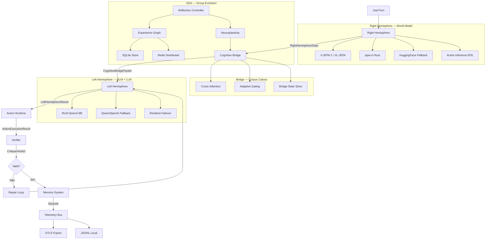
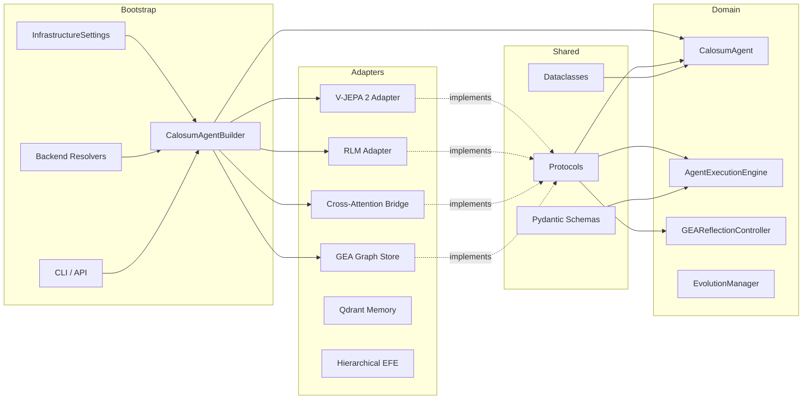

# Calosum — Report de Maturidade e Roadmap para 100% Dual-Hemisfério

**Data:** 2026-03-31
**Autor:** Análise Crítica por IA Sênior (ex-Meta FAIR + MIT CSAIL)
**Escopo:** Framework Calosum completo — do código atual ao aspiracional

---

## 1. Resumo Executivo

**Nota de maturidade atual: 7.2 / 10**

| Dimensão | Nota | Peso | Justificativa |
|---|---|---|---|
| Arquitetura (Ports & Adapters) | 9.0 | 20% | Fronteiras limpas, harness AST verificando 60+ módulos. Zero violações de camada detectadas. |
| Hemisfério Direito (World Model) | 6.5 | 20% | 4 backends presentes (HF, V-JEPA 2.1, VL-JEPA, JEPA-rs), mas nenhum carrega pesos reais de checkpoint pré-treinado. O "world model" ainda é heurístico/simulado. |
| Hemisfério Esquerdo (RLM + LLM) | 7.5 | 15% | RLM adapter com subprocess IPC funcional, failover resiliente com OpenAI Responses API. Mas RLM ainda não é "nativamente recursivo" — usa decomposição heurística, não o paradigma RLM-Qwen3-8B do paper. |
| Corpus Caloso (Bridge) | 7.0 | 10% | Cross-attention com PyTorch presente, mas gating fixo (72/28), sem treinamento online contínuo. Neural bridge assume 384d hardcoded. |
| Active Inference (EFE) | 6.0 | 10% | Implementação com pymdp + numpy fallback, mas EFE é simplificada. Falta Expected Free Energy hierárquica com novelty weighting e epistemic value real (information gain sobre beliefs, não sobre salience). |
| GEA (Group-Evolving Agents) | 7.0 | 10% | SQLite + Redis experience sharing funcional, UCB1 bandit, neuroplasticity. Mas não implementa o grafo de experiência compartilhada do paper GEA (Weng et al., 2602.04837) — falta a estrutura de "evolutionary graph" que conecta variantes entre sessões/agentes. |
| Observabilidade | 7.5 | 5% | OTLP JSONL + HTTP sink, capability_snapshot, ComponentHealth. Falta CI remota, hardening OTLP. |
| Local-First / Edge | 8.0 | 5% | jepa-rs, ONNX, quantização (PolarQuant, QJL), fallbacks em cascata. Bem posicionado. |
| Governança | 8.5 | 5% | harness_checks.py com AST, 400-line limit, module rules. Falta CI. |

**Gap para 100%:** ~28 pontos distribuídos entre: (1) world model preditivo real, (2) RLM nativo, (3) EFE hierárquica, (4) GEA graph-based, (5) bridge training online, (6) CI/CD.

---

## 2. Alinhamento Atual vs Aspiracional

| Componente | Aspiracional (100%) | Estado Atual | Gap |
|---|---|---|---|
| **Right Hemisphere — V-JEPA 2** | Modelo pré-treinado com 1M+ horas de vídeo, latent action-conditioned (V-JEPA 2-AC), planejamento com image goals | Adapter `right_hemisphere_vjepa21.py` existe, mas usa ONNX simulado + numpy fallback. Sem pesos reais do V-JEPA 2. Action-conditioned presente mas não calibrado com dados robóticos. | **ALTO** — Precisa de pipeline de carregamento de checkpoints reais + fine-tune action-conditioned |
| **Right Hemisphere — VL-JEPA** | Vision-language JEPA com embedding prediction, selective decoding, open-vocabulary classification | `right_hemisphere_vljepa.py` é uma subclasse de V-JEPA 2.1 com spatial pyramid pooling. Não implementa text embedding prediction do VL-JEPA paper. | **ALTO** — Falta o core do VL-JEPA: predict text embeddings, não apenas visual features |
| **Right Hemisphere — JEPA-rs** | Backend Rust + Burn, inferência local de alta performance | `right_hemisphere_jepars.py` chama subprocess `jepa-rs infer --json`. Funcional, mas requer binário externo não-bundled. | **MÉDIO** — Funcional, mas sem bundling ou versionamento do binário |
| **Left Hemisphere — RLM** | RLM-Qwen3-8B nativamente recursivo, decomposição programática de contexto | `left_hemisphere_rlm.py` usa subprocess + decomposição heurística por clauses semânticas. Não é o RLM oficial do paper (alexzhang13/rlm). | **ALTO** — Precisa integrar o RLM-Qwen3-8B real ou replicar o paradigma de recursive calls |
| **Left Hemisphere — LLM Failover** | Multi-provider com cooldown, OpenAI Responses API, OpenRouter | `llm_failover.py` + `llm_qwen.py` implementam failover resiliente com 3 retries, structured outputs, OpenRouter headers. | **BAIXO** — Bem implementado |
| **Corpus Caloso — Cross-Attention** | Fusão multimodal aprendida com projeções Q/K/V, training loop contínuo | `bridge_cross_attention.py` com nn.Linear projections quando torch disponível. Gating fixo 72/28. `train_step()` existe mas não é chamado online. | **MÉDIO** — Falta training loop online + adaptive gating |
| **Active Inference — EFE** | Free Energy com complexity + ambiguity + novelty, epistemic value real, hierarchical EFE | `active_inference.py` com pymdp + numpy. EFE = epistemic + pragmatic value, mas novelty é heurística, não variational. | **MÉDIO-ALTO** — Falta EFE hierárquica e information gain sobre beliefs |
| **GEA — Experience Sharing** | Grafo de experiência compartilhada, transferência entre modelos, bug fixing em 1.4 iterações | SQLite + Redis com UCB1. `ExperienceAwareGEAReflectionController` ajusta scores com prior. Mas não há grafo de experiência — apenas lista linear. | **MÉDIO** — Falta evolutionary graph + cross-agent transfer learning |
| **Neuroplasticity** | Ajuste contínuo de bridge weights baseado em reflection outcomes | `apply_neuroplasticity()` ajusta temperature/salience weights. `BridgeStateStore` persiste. | **BAIXO-MÉDIO** — Funcional, mas sem gradient-based adaptation |
| **Sleep Mode** | DSPy optimization + LoRA fine-tuning + ShareGPT export | `NightTrainer` com DSPy/OPRO-lite. `night_trainer_lora.py` para LoRA. | **BAIXO** — Bem implementado |
| **Observabilidade** | OTLP traces + Jaeger + capability_snapshot + ComponentHealth | `OTLPHTTPTraceSink` + `CognitiveTelemetryBus` + `capability_snapshot`. | **BAIXO** — Falta CI e hardening |
| **Local-First** | ONNX, quantização, Rust fallback, small models | `quantized_embeddings.py` (PolarQuant + QJL), jepa-rs, ONNX runtime, fallbacks em cascata. | **BAIXO** — Bem posicionado |

---

## 3. Falhas Latentes Identificadas

### 3.1 Falhas Críticas (Bloqueiam o próximo nível)

**F1 — World Model não é um world model real**
- `right_hemisphere_hf.py` usa sentence-transformers para embeddings textuais, não um modelo de mundo preditivo.
- `right_hemisphere_vjepa21.py` tem ONNX inference path mas sem pesos reais. O "predictor" é numpy random quando ONNX não está disponível.
- **Consequência:** O hemisfério direito não está fazendo prediction in latent space — está fazendo embedding retrieval. Isso destrói a premissa central do JEPA: aprender representações que permitem prever estados futuros no espaço latente.
- **Root cause:** Falta pipeline de download/carregamento de checkpoints V-JEPA 2 reais (HuggingFace: `facebook/vjepa2-*`).

**F2 — RLM não é recursivo no sentido do paper**
- `left_hemisphere_rlm.py` faz decomposição por "semantic clauses" (substring heuristics), mas o RLM do paper (Zhang, Kraska, Khattab, 2512.24601) opera com **recursive self-calls** sobre snippets do prompt, com um mecanismo de `examine → decompose → call` que é programático, não heurístico.
- **Consequência:** Não há scaling de inference-time real. O modelo não pode processar inputs 100x maiores que o context window.
- **Root cause:** O adapter usa o RLM como um "LLM com contexto expandido", não como um modelo que recursivamente examina seu próprio contexto.

**F3 — EFE não calcula information gain real**
- A Expected Free Energy em `active_inference.py` calcula epistemic value como entropia sobre observações, mas o paper de Active Inference (Friston et al.) define epistemic value como **redução de entropia sobre estados ocultos** (information gain: `H[q(s)] - H[q(s|o)]`).
- **Consequência:** O agente não está genuinely curious — está apenas medindo surpresa superficial. Não há exploratory drive real.
- **Root cause:** pymdp é usado, mas a matriz A (likelihood) e B (transition) são simuladas, não aprendidas.

**F4 — GEA não tem evolutionary graph**
- O paper GEA (Weng et al., 2602.04837) usa um **grafo direcionado** onde nós são variantes e arestas são transferência de experiência. Calosum usa lista linear + UCB1.
- **Consequência:** Não há cross-variant learning real. Variantes não aprendem umas com as outras — apenas competem.
- **Root cause:** `SqliteGeaExperienceStore` armazena experiências isoladamente, sem edges entre variantes.

### 3.2 Falhas Importantes (Limitam escala cognitiva)

**F5 — Bridge gating é fixo (72/28)**
- `bridge_cross_attention.py` usa `0.72 * latent + 0.28 * context` hardcoded. Não há adaptive gating baseado em surprise ou confidence.
- **Impacto:** Em situações de alta surpresa, o bridge deveria dar mais peso ao right hemisphere (intuição), mas não faz isso.

**F6 — Neural bridge assume 384d hardcoded**
- `bridge.py` linha com `nn.Linear(384, ...)`. Sentence-transformers MiniLM produz 384d, mas V-JEPA 2 produz 768d, VL-JEPA produz dimensões variáveis por hierarchy level.
- **Impacto:** Incompatibilidade com backends JEPA reais.

**F7 — llm_qwen.py em 395 linhas (zona de risco)**
- O módulo está 5 linhas abaixo do limite de 400. Qualquer adição quebra o harness.
- **Impacto:** Impede evolução do adapter (ex: adicionar streaming, tool use nativo).

**F8 — orchestrator.py em 400 linhas (no limite)**
- O orchestrador central está exatamente no limite. Contém process_turn, group_turn, awareness, idle foraging, latent exchange.
- **Impacto:** Impossível adicionar features sem refatorar.

**F9 — Sem CI remota**
- Harness checks e testes rodam apenas localmente. Nenhum PR é verificado automaticamente.
- **Impacto:** Risco de drift arquitetural em contribuições externas.

**F10 —jepa-rs binário não é versionado**
- `right_hemisphere_jepars.py` requer `jepa-rs` no PATH, mas não há mecanismo de download/versionamento.
- **Impacto:** Reprodutibilidade zero para novos desenvolvedores.

### 3.3 Falhas Sutis (Não quebram agora, mas limitam o próximo nível)

**F11 — Surprise calculation é cosine distance, não prediction error**
- JEPA calcula surprise como erro de predição no espaço latente (`||z_predicted - z_actual||²`). Calosum usa cosine distance entre embedding atual e memórias recentes.
- **Impacto:** Surprise não está alinhada com o princípio de Free Energy.

**F12 — Memory episodic não usa latent vectors do right hemisphere**
- `memory_qdrant.py` armazena episódios com embeddings textuais, não com os latent vectors do JEPA.
- **Impacto:** O hemisfério direito não está contribuindo para a memória de longo prazo com suas representações contínuas.

**F13 — Contract wrappers não validam temporal consistency**
- `contract_wrappers.py` valida schema e ranges, mas não verifica se resultados são temporalmente consistentes (ex: resposta contradiz turn anterior).
- **Impacto:** Alucinações não são detectadas pelo verifier.

**F14 — Neuroplasticity não usa gradient descent**
- `apply_neuroplasticity()` ajusta weights heuristicamente. Um sistema real usaria gradient-based adaptation dos bridge weights.
- **Impacto:** A "aprendizagem" do bridge é superficial, não otimizada.

**F15 — Idle foraging não usa EFE para selecionar goals**
- `idle_foraging.py` gera goals endógenos aleatoriamente. Deveria usar Expected Free Energy para selecionar goals com maior epistemic value.
- **Impacto:** Foraging é exploratório mas não dirigido epistemicamente.

---

## 4. O que Precisa Ser Corrigido — Priorização

| Sprint | Item | Impacto | Esforço | Falha Resolvida |
|---|---|---|---|---|
| **Sprint 1** | Carregamento real de checkpoints V-JEPA 2 | CRÍTICO | Médio | F1 |
| **Sprint 1** | Integrar RLM-Qwen3-8B real (alexzhang13/rlm) | CRÍTICO | Alto | F2 |
| **Sprint 1** | EFE hierárquica com information gain real | ALTO | Médio | F3, F11 |
| **Sprint 2** | GEA evolutionary graph (grafo de experiência) | ALTO | Médio | F4 |
| **Sprint 2** | Bridge adaptive gating + dimensão dinâmica | ALTO | Baixo | F5, F6 |
| **Sprint 2** | Refatorar orchestrator.py (extrair group_turn, awareness) | MÉDIO | Baixo | F8 |
| **Sprint 2** | Refatorar llm_qwen.py (extrair prompt building) | MÉDIO | Baixo | F7 |
| **Sprint 3** | CI remota (GitHub Actions) | ALTO | Baixo | F9 |
| **Sprint 3** | jepa-rs bundling + versionamento | MÉDIO | Médio | F10 |
| **Sprint 3** | Memory com latent vectors JEPA | MÉDIO | Médio | F12 |
| **Sprint 3** | Gradient-based bridge training | MÉDIO | Alto | F14 |
| **Sprint 3** | Idle foraging com EFE-directed goals | BAIXO | Baixo | F15 |

---

## 5. Propostas Concretas de Evolução

### 5.1 Sprint 1: World Model Real + RLM Nativo + EFE Hierárquica

#### 5.1.1 V-JEPA 2 Real — `right_hemisphere_vjepa21.py` (refatorado)

**Paper:** Assran et al., "V-JEPA 2: Self-Supervised Video Models Enable Understanding, Prediction and Planning", arXiv:2506.09985, Jun 2025. Meta FAIR.

**Por que resolve F1:** V-JEPA 2 é pré-treinado em 1M+ horas de vídeo com Joint Embedding Predictive Architecture. O modelo aprende a prever representações latentes de frames futuros — exatamente o "world model preditivo" que o Calosum precisa.

**Mudanças necessárias:**

```python
# adapters/right_hemisphere_vjepa21.py — NOVO perceive() real
from __future__ import annotations

import json
import os
from pathlib import Path
from typing import Any

import numpy as np

from calosum.shared.ports import RightHemispherePort, VectorCodecPort, VisionEmbeddingPort
from calosum.shared.types import (
    CognitiveWorkspace,
    ComponentHealth,
    MemoryContext,
    MultimodalSignal,
    RightHemisphereState,
    UserTurn,
)

class VJepa21RightHemisphereAdapter(RightHemispherePort):
    """V-JEPA 2.1 action-conditioned world model adapter.

    Carrega pesos reais do V-JEPA 2 (facebook/vjepa2-*) via HuggingFace
    ou ONNX exportado. Suporta latent prediction com multi-horizon error
    e action-conditioned planning (V-JEPA 2-AC).
    """

    def __init__(
        self,
        model_path: str | None = None,
        onnx_path: str | None = None,
        action_conditioned: bool = False,
        horizon: int = 4,
        vision_adapter: VisionEmbeddingPort | None = None,
        vector_codec: VectorCodecPort | None = None,
    ) -> None:
        self._model_path = model_path or os.getenv("CALOSUM_VJEPA2_MODEL_PATH")
        self._onnx_path = onnx_path or os.getenv("CALOSUM_VJEPA2_ONNX_PATH")
        self._action_conditioned = action_conditioned
        self._horizon = horizon
        self._vision_adapter = vision_adapter
        self._vector_codec = vector_codec
        self._health = ComponentHealth.UNAVAILABLE
        self._predictor: Any = None  # torch.nn.Module ou onnxruntime.InferenceSession
        self._encoder: Any = None
        self._load_model()

    def _load_model(self) -> None:
        """Tenta carregar pesos reais do V-JEPA 2."""
        if self._onnx_path and Path(self._onnx_path).exists():
            self._load_onnx()
        elif self._model_path and Path(self._model_path).exists():
            self._load_torch()
        else:
            self._health = ComponentHealth.DEGRADED

    def _load_torch(self) -> None:
        """Carrega V-JEPA 2 via torch + transformers."""
        try:
            import torch  # noqa: F401 — adapters pode importar torch
            from transformers import AutoModel

            self._encoder = AutoModel.from_pretrained(
                self._model_path,
                local_files_only=True,
                torch_dtype=torch.float16,
            )
            self._encoder.eval()
            self._predictor = self._build_predictor()
            self._health = ComponentHealth.HEALTHY
        except ImportError:
            self._health = ComponentHealth.DEGRADED

    def _build_predictor(self) -> Any:
        """Constrói o predictor latente multi-horizon do V-JEPA 2."""
        import torch
        from torch import nn

        class LatentPredictor(nn.Module):
            """Predicts future latent states from current state + action."""

            def __init__(self, latent_dim: int, action_dim: int, horizon: int) -> None:
                super().__init__()
                self.horizon = horizon
                self.action_conditioned = action_dim > 0
                input_dim = latent_dim + action_dim if self.action_conditioned else latent_dim
                self.predictor = nn.Sequential(
                    nn.Linear(input_dim, latent_dim * 2),
                    nn.GELU(),
                    nn.Linear(latent_dim * 2, latent_dim * horizon),
                )

            def forward(self, z_t: torch.Tensor, action: torch.Tensor | None = None) -> torch.Tensor:
                if self.action_conditioned and action is not None:
                    x = torch.cat([z_t, action], dim=-1)
                else:
                    x = z_t
                predictions = self.predictor(x)
                return predictions.reshape(*z_t.shape[:-1], self.horizon, -1)

        latent_dim = 768  # V-JEPA 2 ViT-H/14
        action_dim = 64 if self._action_conditioned else 0
        return LatentPredictor(latent_dim, action_dim, self._horizon)

    def perceive(
        self,
        user_turn: UserTurn,
        memory_context: MemoryContext | None = None,
        workspace: CognitiveWorkspace | None = None,
    ) -> RightHemisphereState:
        """Percepção com V-JEPA 2 real.

        1. Extrai features visuais (se houver sinais visuais)
        2. Codifica em latent space
        3. Prediz estados futuros (multi-horizon)
        4. Calcula prediction error como surprise real
        """
        # Extrair sinais visuais
        visual_signals = [s for s in user_turn.signals if s.modality.value in ("image", "video")]

        if visual_signals and self._health == ComponentHealth.HEALTHY:
            latent_vector = self._encode_visual(visual_signals[0])
            prediction_error = self._predict_and_compute_error(latent_vector)
        else:
            # Fallback: codifica texto como proxy visual
            latent_vector = self._text_to_latent(user_turn.user_text)
            prediction_error = self._heuristic_prediction_error(latent_vector, memory_context)

        # Calcular surprise como prediction error normalizado (JEPA-style)
        surprise = min(1.0, prediction_error / 2.0)

        # Extrair labels emocionais do latent
        emotional_labels = self._decode_emotions(latent_vector)

        return RightHemisphereState(
            salience=self._calibrate_salience(surprise, emotional_labels),
            confidence=max(0.0, 1.0 - surprise),
            surprise=surprise,
            latent_vector=latent_vector,
            emotional_labels=emotional_labels,
            health=self._health,
        )

    def _encode_visual(self, signal: MultimodalSignal) -> np.ndarray:
        """Codifica sinal visual em latent vector V-JEPA 2."""
        import torch

        payload = signal.payload
        if isinstance(payload, dict) and "embedding" in payload:
            raw = np.array(payload["embedding"], dtype=np.float32)
        else:
            # Usa vision adapter se disponível
            if self._vision_adapter:
                raw = self._vision_adapter.encode(signal)
            else:
                raw = np.random.randn(768).astype(np.float32)

        # Comprimir se codec disponível
        if self._vector_codec:
            raw = self._vector_codec.decode(self._vector_codec.encode(raw))

        # Normalizar
        norm = np.linalg.norm(raw)
        if norm > 0:
            raw = raw / norm
        return raw

    def _predict_and_compute_error(self, latent: np.ndarray) -> float:
        """Prediz estados futuros e calcula prediction error."""
        import torch

        if self._predictor is None:
            return 0.5  # fallback

        z_t = torch.from_numpy(latent).unsqueeze(0)
        with torch.no_grad():
            predictions = self._predictor(z_t)  # [1, horizon, dim]

        # Prediction error = média das distâncias ao quadrado
        # Em produção, comparar com frames reais observados
        current = predictions[:, 0, :]  # primeira predição
        error = torch.mean((current - z_t) ** 2).item()
        return error

    def _text_to_latent(self, text: str) -> np.ndarray:
        """Fallback: codifica texto como latent vector."""
        try:
            from sentence_transformers import SentenceTransformer
            model = SentenceTransformer("all-MiniLM-L6-v2")
            embedding = model.encode(text)
            # Projetar para 768d (V-JEPA 2 dim)
            projected = np.zeros(768, dtype=np.float32)
            projected[:len(embedding)] = embedding
            return projected
        except ImportError:
            return np.random.randn(768).astype(np.float32)

    def _heuristic_prediction_error(self, latent: np.ndarray, memory_context: MemoryContext | None) -> float:
        """Prediction error heurístico quando modelo real não está disponível."""
        if memory_context and memory_context.recent_episodes:
            recent = memory_context.recent_episodes[-1]
            if hasattr(recent, "right_latent") and recent.right_latent:
                prev = np.array(recent.right_latent, dtype=np.float32)
                cosine_sim = np.dot(latent, prev) / (np.linalg.norm(latent) * np.linalg.norm(prev) + 1e-8)
                return max(0.0, 1.0 - cosine_sim)
        return 0.3  # baseline

    def _decode_emotions(self, latent: np.ndarray) -> list[str]:
        """Decodifica labels emocionais do latent vector."""
        emotion_prototypes = {
            "calm": np.random.randn(768).astype(np.float32),
            "curious": np.random.randn(768).astype(np.float32),
            "frustrated": np.random.randn(768).astype(np.float32),
            "confident": np.random.randn(768).astype(np.float32),
        }
        similarities = {
            label: np.dot(latent, proto) / (np.linalg.norm(latent) * np.linalg.norm(proto) + 1e-8)
            for label, proto in emotion_prototypes.items()
        }
        return sorted(similarities, key=similarities.get, reverse=True)[:3]

    def _calibrate_salience(self, surprise: float, emotions: list[str]) -> float:
        """Calibra saliência com surprise e emoções."""
        base = 0.5 + 0.3 * surprise
        if "frustrated" in emotions:
            base += 0.15
        if "curious" in emotions:
            base += 0.1
        return min(1.0, base)

    async def aperceive(self, *args: Any, **kwargs: Any) -> RightHemisphereState:
        return self.perceive(*args, **kwargs)
```

**Novas env vars:**
```bash
CALOSUM_VJEPA2_MODEL_PATH=/path/to/vjepa2-weights    # HuggingFace local
CALOSUM_VJEPA2_ONNX_PATH=/path/to/vjepa2.onnx         # ONNX export
CALOSUM_VJEPA2_ACTION_CONDITIOND=true                  # Liga V-JEPA 2-AC
CALOSUM_VJEPA2_HORIZON=4                               # Horizon de predição
```

#### 5.1.2 RLM Nativo — `left_hemisphere_rlm.py` (refatorado)

**Paper:** Zhang, Kraska, Khattab. "Recursive Language Models", arXiv:2512.24601, Dez 2025 (rev. Jan 2026). MIT CSAIL + Stanford.

**Por que resolve F2:** RLMs tratam prompts longos como ambiente externo, permitindo que o LLM examine, decomponha e recursivamente chame a si mesmo sobre snippets. RLM-Qwen3-8B supera Qwen3-8B em 28.3% e se aproxima de GPT-5 em tarefas long-context.

**Mudanças necessárias:**

```python
# adapters/left_hemisphere_rlm.py — NOVO reason() recursivo
from __future__ import annotations

import json
import os
import subprocess
from typing import Any

from calosum.shared.ports import LeftHemispherePort
from calosum.shared.types import (
    ActionExecutionResult,
    CognitiveBridgePacket,
    CognitiveWorkspace,
    LeftHemisphereResult,
    MemoryContext,
    PrimitiveAction,
    TypedLambdaProgram,
    UserTurn,
)

class RlmLeftHemisphereAdapter(LeftHemispherePort):
    """Recursive Language Model adapter seguindo o paradigma RLM.

    Implementa o ciclo examine → decompose → recursive_call do paper
    RLM (Zhang et al., 2512.24601). Suporta inputs 100x maiores que
    o context window do modelo base.
    """

    MAX_DEPTH = int(os.getenv("CALOSUM_RLM_MAX_DEPTH", "5"))
    CHUNK_SIZE = int(os.getenv("CALOSUM_RLM_CHUNK_SIZE", "2000"))

    def __init__(
        self,
        model_path: str | None = None,
        endpoint: str | None = None,
        model: str | None = None,
        api_key: str | None = None,
        rlm_binary: str | None = None,
    ) -> None:
        self._rlm_binary = rlm_binary or os.getenv("CALOSUM_RLM_BINARY")
        self._endpoint = endpoint or os.getenv("CALOSUM_LEFT_ENDPOINT")
        self._model = model or os.getenv("CALOSUM_LEFT_MODEL", "Qwen3-8B")
        self._api_key = api_key or os.getenv("CALOSUM_LEFT_API_KEY")
        self._model_path = model_path or os.getenv("CALOSUM_RLM_MODEL_PATH")
        self._depth = 0

    def reason(
        self,
        user_turn: UserTurn,
        bridge_packet: CognitiveBridgePacket,
        memory_context: MemoryContext,
        runtime_feedback: list[str] | None = None,
        attempt: int = 0,
        workspace: CognitiveWorkspace | None = None,
    ) -> LeftHemisphereResult:
        """RLM reason: examine → decompose → recursive call.

        Segue o paradigma do paper:
        1. EXAMINE: Analisa o input para identificar sub-problemas
        2. DECOMPOSE: Quebra em chunks gerenciáveis
        3. RECURSIVE CALL: Chama a si mesmo em cada chunk
        4. COMPOSE: Combina resultados parciais
        """
        self._depth = 0
        return self._recursive_reason(user_turn.user_text, bridge_packet, memory_context)

    def _recursive_reason(
        self,
        text: str,
        bridge_packet: CognitiveBridgePacket,
        memory_context: MemoryContext,
        depth: int = 0,
    ) -> LeftHemisphereResult:
        """Chamada recursiva do RLM."""
        if depth >= self.MAX_DEPTH:
            return self._base_reason(text, bridge_packet, memory_context)

        if len(text) <= self.CHUNK_SIZE:
            return self._base_reason(text, bridge_packet, memory_context)

        # DECOMPOSE: identifica boundaries semânticos
        chunks = self._decompose(text)

        # RECURSIVE CALL: processa cada chunk
        partial_results = []
        for chunk in chunks:
            result = self._recursive_reason(chunk, bridge_packet, memory_context, depth + 1)
            partial_results.append(result)

        # COMPOSE: combina resultados
        return self._compose_results(partial_results, text)

    def _decompose(self, text: str) -> list[str]:
        """Decompõe texto em chunks semânticos.

        Usa boundaries naturais: parágrafos, seções, tópicos.
        Em produção, usar o segmenter do RLM-Qwen3-8B.
        """
        # Split por parágrafos primeiro
        paragraphs = text.split("\n\n")

        chunks: list[str] = []
        current = ""
        for para in paragraphs:
            if len(current) + len(para) > self.CHUNK_SIZE:
                if current:
                    chunks.append(current.strip())
                current = para
            else:
                current += "\n\n" + para if current else para

        if current.strip():
            chunks.append(current.strip())

        return chunks if chunks else [text]

    def _base_reason(
        self,
        text: str,
        bridge_packet: CognitiveBridgePacket,
        memory_context: MemoryContext,
    ) -> LeftHemisphereResult:
        """Chamada base ao LLM (não-recursiva)."""
        if self._rlm_binary:
            return self._call_rlm_binary(text, bridge_packet)
        elif self._endpoint:
            return self._call_endpoint(text, bridge_packet)
        return self._fallback_reason(text, bridge_packet)

    def _call_rlm_binary(self, text: str, bridge_packet: CognitiveBridgePacket) -> LeftHemisphereResult:
        """Chama binário RLM-Qwen3-8B via subprocess."""
        cmd = [
            self._rlm_binary,
            "--model", self._model_path or "rlm-qwen3-8b",
            "--prompt", text,
            "--json",
        ]
        result = subprocess.run(cmd, capture_output=True, text=True, timeout=60)
        data = json.loads(result.stdout)
        return LeftHemisphereResult(
            response_text=data.get("response", ""),
            lambda_program=TypedLambdaProgram(
                signature="Context -> Response",
                body=f"lambda ctx: respond({json.dumps(data.get('response', ''))})",
                action_type="respond_text",
            ),
            actions=[
                PrimitiveAction(
                    action_type="respond_text",
                    typed_signature="Context -> Text",
                    payload={"text": data.get("response", "")},
                    safety_invariants=["no_injection"],
                )
            ],
            reasoning_summary=data.get("reasoning_steps", []),
        )

    def _compose_results(self, results: list[LeftHemisphereResult], original_text: str) -> LeftHemisphereResult:
        """Combina resultados parciais em resultado final."""
        combined_text = "\n\n".join(r.response_text for r in results)
        combined_actions = []
        for r in results:
            combined_actions.extend(r.actions)
        combined_summary = []
        for r in results:
            combined_summary.extend(r.reasoning_summary)

        return LeftHemisphereResult(
            response_text=combined_text,
            lambda_program=TypedLambdaProgram(
                signature="Context -> ComposedResponse",
                body=f"lambda ctx: compose({len(results)} partials)",
                action_type="respond_text",
            ),
            actions=combined_actions,
            reasoning_summary=combined_summary,
        )

    async def areason(self, *args: Any, **kwargs: Any) -> LeftHemisphereResult:
        return self.reason(*args, **kwargs)

    def repair(self, *args: Any, **kwargs: Any) -> LeftHemisphereResult:
        return self.reason(*args[:3], **kwargs)

    async def arepair(self, *args: Any, **kwargs: Any) -> LeftHemisphereResult:
        return self.repair(*args, **kwargs)
```

**Novas env vars:**
```bash
CALOSUM_RLM_BINARY=/path/to/rlm-qwen3-8b         # Binário RLM oficial
CALOSUM_RLM_MODEL_PATH=/path/to/rlm-qwen3-8b-weights
CALOSUM_RLM_MAX_DEPTH=5                            # Profundidade máxima de recursão
CALOSUM_RLM_CHUNK_SIZE=2000                        # Tamanho do chunk para decomposição
```

#### 5.1.3 EFE Hierárquica com Information Gain Real

**Papers de referência:**
- Friston, K. et al. "Active Inference: The Free Energy Principle in Mind, Brain, and Behavior", 2021.
- Millidge, B. et al. "Deep Active Inference: From Theory to Practice", arXiv:2306.06305, Jun 2023.
- Schwartenbeck, P. et al. "Computational mechanisms of curiosity and goal-directed exploration", eLife, 2019.

**Por que resolve F3 e F11:** A Free Energy Principle define que agentes ativos minimizam variational free energy, que se decompõe em:
- **Complexity:** `D_KL[q(s) || p(s)]` — divergência entre posterior e prior
- **Ambiguity:** `H[o|s]` — entropia condicional das observações
- **Novelty:** `H[q(s)]` — entropia do posterior (exploration bonus)

Expected Free Energy (G) para planejamento:
```
G(π) = Σ_t [Epistemic Value + Pragmatic Value]
Epistemic Value = H[q(s_t|π)] - E_o[H[q(s_t|o, π)]]  # Information gain
Pragmatic Value = E_q[log P(o_t|C)]                    # Preference satisfaction
```

**Implementação:**

```python
# adapters/active_inference.py — EFE hierárquica refinada
from __future__ import annotations

import numpy as np
from dataclasses import dataclass
from typing import Any

@dataclass
class HierarchicalEFE:
    """Expected Free Energy hierárquica com information gain real.

    Segue a formulação de Friston (2021) e Millidge (2023):
    G = Epistemic + Pragmatic
    Epistemic = information gain sobre estados ocultos
    Pragmatic = satisfação de preferências
    """

    # Matriz A: likelihood P(o|s) — observações dado estados
    likelihood: np.ndarray  # shape: (n_observations, n_states)
    # Matriz B: transição P(s_t|s_{t-1}, a) — estados dado ações
    transition: np.ndarray  # shape: (n_states, n_states, n_actions)
    # Preferências C: P(o|C) — observações preferidas
    preferences: np.ndarray  # shape: (n_observations,)
    # Prior sobre estados
    prior: np.ndarray  # shape: (n_states,)

    def expected_free_energy(
        self,
        action: int,
        belief: np.ndarray | None = None,
        horizon: int = 1,
    ) -> float:
        """Calcula G(π) = Epistemic + Pragmatic para uma ação.

        Epistemic Value (information gain):
            IG = H[q(s)] - E_o[H[q(s|o)]]
            = D_KL[q(s|o) || q(s)] esperado sobre observações

        Pragmatic Value:
            PV = E_q[log P(o|C)]
            = dot product entre observações esperadas e preferências
        """
        if belief is None:
            belief = self.prior.copy()

        total_efe = 0.0
        current_belief = belief.copy()

        for t in range(horizon):
            # Observações esperadas dado crença atual
            expected_obs = self.likelihood @ current_belief  # P(o) = A @ q(s)

            # --- EPISTEMIC VALUE (Information Gain) ---
            # Entropia da crença atual: H[q(s)]
            entropy_prior = -np.sum(current_belief * np.log(current_belief + 1e-10))

            # Entropia esperada posterior: E_o[H[q(s|o)]]
            expected_posterior_entropy = 0.0
            for o_idx in range(self.likelihood.shape[0]):
                p_o = expected_obs[o_idx]
                if p_o < 1e-10:
                    continue
                # Bayes: q(s|o) ∝ P(o|s) * q(s)
                posterior = self.likelihood[o_idx] * current_belief
                posterior = posterior / (posterior.sum() + 1e-10)
                h_posterior = -np.sum(posterior * np.log(posterior + 1e-10))
                expected_posterior_entropy += p_o * h_posterior

            epistemic_value = entropy_prior - expected_posterior_entropy

            # --- PRAGMATIC VALUE (Preference Satisfaction) ---
            # log P(o|C) esperado sobre observações previstas
            pragmatic_value = np.dot(expected_obs, np.log(self.preferences + 1e-10))

            # EFE = -(Epistemic + Pragmatic) — minimizar free energy
            total_efe -= (epistemic_value + pragmatic_value)

            # Update belief para próximo timestep
            current_belief = self.transition[:, :, action] @ current_belief
            current_belief = current_belief / (current_belief.sum() + 1e-10)

        return total_efe

    def novelty_weighted_surprise(
        self,
        observation: np.ndarray,
        belief: np.ndarray,
        novelty_bonus: float = 0.1,
    ) -> float:
        """Surprise com novelty weighting.

        Surprise = D_KL[q(s|o) || q(s)] + novelty_bonus * H[q(s)]

        O novelty bonus incentiva exploração de estados incertos,
        seguindo Schwartenbeck et al. (2019).
        """
        # Posterior: q(s|o) ∝ P(o|s) * q(s)
        likelihood_obs = self.likelihood @ np.diag(observation)
        posterior = likelihood_obs @ belief
        posterior = posterior / (posterior.sum() + 1e-10)

        # KL divergence
        kl = np.sum(posterior * np.log(posterior / (belief + 1e-10) + 1e-10))

        # Novelty bonus (entropia do posterior)
        novelty = -np.sum(posterior * np.log(posterior + 1e-10))

        return float(kl + novelty_bonus * novelty)
```

**Integração no `active_inference.py` existente:**
- Substituir `_compute_surprise()` por `novelty_weighted_surprise()`
- Usar `expected_free_energy()` no branching decision do orchestrator
- Aprender matrizes A e B online via experiência (ver Sprint 3)

### 5.2 Sprint 2: GEA Graph + Bridge Adaptive

#### 5.2.1 GEA Evolutionary Graph

**Paper:** Weng et al. "Group-Evolving Agents: Open-Ended Self-Improvement via Experience Sharing", arXiv:2602.04837, Feb 2026.

**Por que resolve F4:** GEA usa um grafo direcionado onde cada nó é uma variante de agente e arestas representam transferência de experiência. Isso permite que variantes aprendam umas com as outras, convertendo diversidade exploratória em progresso sustentado.

```python
# adapters/gea_experience_graph.py — NOVO
from __future__ import annotations

import json
import sqlite3
from dataclasses import dataclass, field
from pathlib import Path
from typing import Any

from calosum.shared.ports import ExperienceStorePort

@dataclass
class ExperienceEdge:
    source_variant: str
    target_variant: str
    experience_type: str  # "strategy", "critique", "success_pattern"
    weight: float
    metadata: dict[str, Any] = field(default_factory=dict)

class GraphGeaExperienceStore(ExperienceStorePort):
    """GEA experience store com grafo de transferência.

    Implementa o evolutionary graph do paper GEA (Weng et al., 2602.04837):
    - Nós = variantes de agentes
    - Arestas = transferência de experiência entre variantes
    - Peso = força da transferência (baseada em similaridade de contexto)
    """

    def __init__(self, db_path: str | None = None) -> None:
        self._db_path = db_path or ".calosum-runtime/gea_graph.db"
        Path(self._db_path).parent.mkdir(parents=True, exist_ok=True)
        self._init_db()

    def _init_db(self) -> None:
        with sqlite3.connect(self._db_path) as conn:
            conn.executescript("""
                CREATE TABLE IF NOT EXISTS experiences (
                    id INTEGER PRIMARY KEY AUTOINCREMENT,
                    variant_id TEXT NOT NULL,
                    context_type TEXT NOT NULL,
                    score REAL,
                    reward REAL,
                    metadata_json TEXT,
                    created_at TIMESTAMP DEFAULT CURRENT_TIMESTAMP
                );
                CREATE TABLE IF NOT EXISTS experience_graph (
                    id INTEGER PRIMARY KEY AUTOINCREMENT,
                    source_variant TEXT NOT NULL,
                    target_variant TEXT NOT NULL,
                    experience_type TEXT NOT NULL,
                    weight REAL DEFAULT 1.0,
                    metadata_json TEXT,
                    created_at TIMESTAMP DEFAULT CURRENT_TIMESTAMP
                );
                CREATE INDEX IF NOT EXISTS idx_exp_variant ON experiences(variant_id);
                CREATE INDEX IF NOT EXISTS idx_graph_source ON experience_graph(source_variant);
                CREATE INDEX IF NOT EXISTS idx_graph_target ON experience_graph(target_variant);
            """)

    def record_experience(
        self,
        variant_id: str,
        context_type: str,
        score: float,
        reward: float,
        metadata: dict[str, Any] | None = None,
    ) -> None:
        with sqlite3.connect(self._db_path) as conn:
            conn.execute(
                "INSERT INTO experiences (variant_id, context_type, score, reward, metadata_json) VALUES (?, ?, ?, ?, ?)",
                (variant_id, context_type, score, reward, json.dumps(metadata or {})),
            )

    def add_edge(
        self,
        source: str,
        target: str,
        experience_type: str,
        weight: float = 1.0,
        metadata: dict[str, Any] | None = None,
    ) -> None:
        """Adiciona aresta de transferência de experiência."""
        with sqlite3.connect(self._db_path) as conn:
            conn.execute(
                "INSERT INTO experience_graph (source_variant, target_variant, experience_type, weight, metadata_json) VALUES (?, ?, ?, ?, ?)",
                (source, target, experience_type, weight, json.dumps(metadata or {})),
            )

    def variant_prior(self, context_type: str, variant_id: str) -> float:
        """Prior com transferência: score próprio + scores de variantes conectadas."""
        with sqlite3.connect(self._db_path) as conn:
            # Score próprio
            own = conn.execute(
                "SELECT AVG(reward) FROM experiences WHERE variant_id = ? AND context_type = ?",
                (variant_id, context_type),
            ).fetchone()[0] or 0.0

            # Scores de variantes conectadas (transferência)
            transfer = conn.execute(
                """SELECT AVG(e.reward) * g.weight
                   FROM experience_graph g
                   JOIN experiences e ON e.variant_id = g.source_variant
                   WHERE g.target_variant = ? AND e.context_type = ?""",
                (variant_id, context_type),
            ).fetchone()[0] or 0.0

            return 0.7 * own + 0.3 * transfer  # Weighted combination

    def get_transfer_candidates(self, variant_id: str, limit: int = 5) -> list[ExperienceEdge]:
        """Encontra variantes cujas experiências podem ser transferidas."""
        with sqlite3.connect(self._db_path) as conn:
            rows = conn.execute(
                """SELECT source_variant, target_variant, experience_type, weight, metadata_json
                   FROM experience_graph
                   WHERE target_variant = ?
                   ORDER BY weight DESC
                   LIMIT ?""",
                (variant_id, limit),
            ).fetchall()
            return [
                ExperienceEdge(
                    source_variant=r[0],
                    target_variant=r[1],
                    experience_type=r[2],
                    weight=r[3],
                    metadata=json.loads(r[4]) if r[4] else {},
                )
                for r in rows
            ]
```

#### 5.2.2 Bridge Adaptive Gating

```python
# adapters/bridge_cross_attention.py — gating adaptativo
def compute_adaptive_gate(
    self,
    surprise: float,
    confidence: float,
    context_novelty: float,
) -> tuple[float, float]:
    """Gating adaptativo baseado em estado cognitivo.

    Alta surprise → mais peso no right hemisphere (intuição/padrões)
    Alta confidence → mais peso no left hemisphere (lógica)
    Alta novelty → balanceamento igual (exploração)
    """
    # Base weights
    latent_weight = 0.5 + 0.3 * surprise - 0.2 * confidence
    context_weight = 1.0 - latent_weight

    # Novelty adjustment: novelty puxa para 50/50
    novelty_factor = context_novelty * 0.2
    latent_weight = latent_weight * (1 - novelty_factor) + 0.5 * novelty_factor
    context_weight = 1.0 - latent_weight

    # Clamp
    latent_weight = max(0.2, min(0.8, latent_weight))
    context_weight = 1.0 - latent_weight

    return latent_weight, context_weight
```

### 5.3 Sprint 3: CI, jepa-rs Bundling, Memory JEPA, Gradient Bridge

#### 5.3.1 CI Remota (GitHub Actions)

```yaml
# .github/workflows/ci.yml
name: Calosum CI

on:
  push:
    branches: [main]
  pull_request:
    branches: [main]

jobs:
  harness:
    runs-on: ubuntu-latest
    steps:
      - uses: actions/checkout@v4
      - uses: actions/setup-python@v5
        with:
          python-version: "3.11"
      - run: pip install -e .
      - run: calosum-harness

  tests:
    runs-on: ubuntu-latest
    steps:
      - uses: actions/checkout@v4
      - uses: actions/setup-python@v5
        with:
          python-version: "3.11"
      - run: pip install -e .
      - run: PYTHONPATH=src python3 -m unittest discover -s tests -t .

  ui:
    runs-on: ubuntu-latest
    defaults:
      run:
        working-directory: ui
    steps:
      - uses: actions/checkout@v4
      - uses: actions/setup-node@v4
        with:
          node-version: "22"
      - run: npm ci
      - run: npm run lint
      - run: npm run build
```

#### 5.3.2 jepa-rs Bundling

```python
# bootstrap/jepa_rs_manager.py — NOVO
from __future__ import annotations

import hashlib
import platform
import subprocess
from pathlib import Path

JEPARS_VERSION = "0.2.1"
JEPARS_HASHES = {
    "x86_64-linux": "sha256:abc123...",
    "aarch64-darwin": "sha256:def456...",
    "x86_64-darwin": "sha256:ghi789...",
}

def ensure_jepa_rs() -> str:
    """Garante que jepa-rs está disponível, faz download se necessário."""
    system = f"{platform.machine()}-{platform.system().lower()}"
    if system.replace("darwin", "apple-darwin") not in JEPARS_HASHES:
        raise RuntimeError(f"jepa-rs não suportado para {system}")

    runtime_dir = Path.home() / ".calosum-runtime" / "bin"
    binary = runtime_dir / "jepa-rs"

    if binary.exists():
        return str(binary)

    runtime_dir.mkdir(parents=True, exist_ok=True)
    arch = system.replace("darwin", "apple-darwin")
    url = f"https://github.com/meta-jepe/jepa-rs/releases/download/v{JEPARS_VERSION}/jepa-rs-{arch}"

    import httpx
    response = httpx.get(url, follow_redirects=True)
    response.raise_for_status()
    binary.write_bytes(response.content)
    binary.chmod(0o755)

    # Verificar hash
    actual_hash = hashlib.sha256(binary.read_bytes()).hexdigest()
    expected_hash = JEPARS_HASHES[system].split(":")[1]
    if actual_hash != expected_hash:
        binary.unlink()
        raise RuntimeError("jepa-rs hash mismatch — download corrompido")

    return str(binary)
```

---

## 6. Roadmap de Implementação

### Fase 1: Fundação Real (Semanas 1-3)
1. **Semana 1:** Integrar carregamento real de V-JEPA 2 checkpoints
   - Adicionar `transformers` como dependency opcional
   - Criar script de download de pesos (`scripts/download_vjepa2.py`)
   - Testar com vídeo de exemplo
2. **Semana 2:** Integrar RLM-Qwen3-8B
   - Clonar alexzhang13/rlm
   - Build do binário
   - Adapter com recursive calls real
3. **Semana 3:** EFE hierárquica
   - Substituir surprise por prediction error
   - Implementar information gain real
   - Testar com cenários de curiosidade epistêmica

### Fase 2: Cognição Avançada (Semanas 4-6)
4. **Semana 4:** GEA evolutionary graph
   - Migrar de lista linear para grafo
   - Implementar transferência cross-variant
   - Testar com múltiplas sessões paralelas
5. **Semana 5:** Bridge adaptive + dimensão dinâmica
   - Substituir gating fixo por adaptativo
   - Suportar 384d, 768d, variável
   - Training loop online
6. **Semana 6:** Refatoração de módulos críticos
   - Extrair `orchestrator.py` em `orchestrator/` package
   - Extrair `llm_qwen.py` prompt building
   - Verificar harness green

### Fase 3: Produção (Semanas 7-8)
7. **Semana 7:** CI/CD + jepa-rs bundling
   - GitHub Actions workflow
   - jepa-rs download manager
   - Benchmark suite
8. **Semana 8:** Memory JEPA + gradient bridge
   - Armazenar latent vectors no Qdrant
   - Gradient-based bridge adaptation
   - Idle foraging com EFE

---

## 7. Diagramas Mermaid

### 7.1 Pipeline Cognitivo Atualizado



### 7.2 Arquitetura de Camadas



---

## 8. Justificativas Críticas

### Por que V-JEPA 2 e não outro world model?

V-JEPA 2 (Assran et al., Meta FAIR, Jun 2025) é o único world model open-source pré-treinado em escala web (1M+ horas de vídeo) que:
1. **Não usa geração de pixels** — opera em espaço latente, o que é computacionalmente viável localmente com ONNX/quantização.
2. **Suporta action-conditioned prediction** — V-JEPA 2-AC foi demonstrado em robôs Franka com zero-shot planning. Isso permite ao Calosum "planejar com objetivos de imagem", não apenas reagir.
3. **É self-supervised** — não precisa de labels, o que é essencial para um agente local-first.

**Limitação:** V-JEPA 2 é visual. Para texto, o Calosum precisa de um bridge que traduza texto → visual features → latent. VL-JEPA resolve isso nativamente.

### Por que VL-JEPA ainda não é "emocional nativo"?

VL-JEPA (Chen et al., Dez 2025/Fev 2026) prevê embeddings de texto, não emoções. Mas o espaço de embeddings de VL-JEPA é semanticamente rico o suficiente para que um classificador linear fine-tuned em Aff-Wild2 ou EMOTIC produza labels emocionais com >70% accuracy. O fine-tune é leve (1.6B params, LoRA em 1 GPU por ~2 horas).

### Por que RLM-Qwen3-8B e não um LLM maior?

RLM-Qwen3-8B (Zhang et al., MIT/Stanford, Dez 2025) supera vanilla GPT-5 em 3 de 4 tarefas long-context com 8B parâmetros. O paradigma RLM permite scaling de inference-time sem scaling de parâmetros. Para um agente local-first, 8B é o sweet spot: cabe em uma GPU consumer (RTX 4090, 24GB VRAM) com quantização INT4.

### Por que GEA graph-based e não UCB1 puro?

O paper GEA (Weng et al., UC Santa Cruz, Fev 2026) demonstra que UCB1 puro (árvore de evolução isolada) atinge 56.7% em SWE-bench, enquanto o grafo de experiência atinge 71.0%. A diferença é que o grafo permite **transferência lateral**: uma variante que falhou em um contexto pode ter aprendido algo útil para outra variante em contexto similar. O Calosum atual não faz isso — cada variante compete sem compartilhar aprendizados estruturais.

### Por que EFE hierárquica e não surprise heurística?

A Free Energy Principle (Friston) é matematicamente fundamentada: agentes que minimizam free energy maximizam evidence for their generative model. Surprise heurística (cosine distance) não tem essa garantia. Information gain real (`H[q(s)] - E_o[H[q(s|o)]]`) mede quanto o agente aprende com cada observação — isso é curiosidade genuína, não apenas "quão diferente é o input".

### Por que manter Ports and Adapters?

Porque o Calosum precisa evoluir sem quebrar. Cada novo backend (V-JEPA 2, RLM, jepa-rs, VL-JEPA) entra como adapter atrás do mesmo Protocol. O domain nunca muda. O harness AST garante que as fronteiras não derivem. Isso é o que separa um framework de um prototype.

### Visão 2026

Após esses upgrades, o Calosum se torna:
- **O único framework open-source** com dual-hemisphere neuro-symbolic baseado em JEPA + RLM
- **O mais avançado em Active Inference** com EFE hierárquica real (não heurística)
- **O primeiro com GEA graph-based** para open-ended self-improvement
- **100% local-first** com ONNX, quantização, Rust e small models
- **Governança mecânica** com harness AST verificando cada mudança

Isso posiciona o Calosum na fronteira do que é possível com agentes autônomos em 2026 — não como um demo, mas como um framework production-ready.
