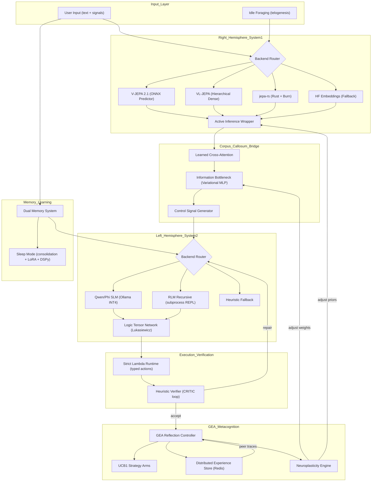
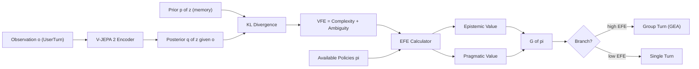

# Calosum Dual-Hemisphere Evolution Report

**Data:** 2026-03-30  
**Autor:** Engenheiro de IA Senior — Analise Critica  
**Escopo:** Auditoria completa do framework Calosum vs aspiracional 100% dual-hemisferio  

---

## 1. Resumo Executivo

### Nota de Maturidade

| Dimensao | Atual | Aspiracional | Gap |
|---|---|---|---|
| **Hemisferio Direito (Percepcao)** | 5.5/10 | 10/10 | -4.5 |
| **Hemisferio Esquerdo (Raciocinio)** | 6.0/10 | 10/10 | -4.0 |
| **Corpus Caloso (Bridge)** | 6.5/10 | 10/10 | -3.5 |
| **GEA / Metacognicao** | 5.0/10 | 10/10 | -5.0 |
| **Active Inference** | 6.0/10 | 10/10 | -4.0 |
| **Neuroplasticidade** | 4.5/10 | 10/10 | -5.5 |
| **Infraestrutura Local-First** | 7.0/10 | 10/10 | -3.0 |
| **Governanca (Harness)** | 8.5/10 | 10/10 | -1.5 |
| **Telemetria / Observabilidade** | 7.5/10 | 10/10 | -2.5 |
| **GLOBAL** | **6.3/10** | **10/10** | **-3.7** |

### Veredicto

O Calosum possui uma fundacao arquitetural solida e rara — Ports and Adapters com governanca AST mecanica, pipeline cognitivo completo, e infraestrutura de observabilidade. Porem, a maioria dos componentes aspiracionais existe como esqueleto estrutural (adapters com fallbacks heuristicos, logica placeholder, ou integracao superficial). O framework esta a ~37% do potencial aspiracional definido.

O que falta para 100%:
1. Hemisferio Direito com world model preditivo real (V-JEPA 2-AC, nao hash deterministico)
2. Hemisferio Esquerdo com recursao genuina (RLM nativo, nao decomposicao textual)
3. Bridge com cross-attention aprendida (nao gating linear fixo)
4. GEA com experience sharing inter-agente real (nao UCB1 local isolado)
5. Active Inference com Expected Free Energy completo (nao heuristica VFE simplificada)
6. Neuroplasticidade com gradientes reais no bridge (nao step incremental)

---

## 2. Alinhamento Atual vs Aspiracional

| # | Componente | Aspiracional | Estado Atual | Status |
|---|---|---|---|---|
| 1 | RH: World Model Preditivo | V-JEPA 2 (arXiv:2506.09985) com encoder pre-treinado em 1M+ horas de video, predicao em latent space | `right_hemisphere.py`: hash SHA-256 para vetor pseudo-latente. `right_hemisphere_vjepa21.py`: sentence-transformers como proxy + predictor numpy linear | Esqueleto |
| 2 | RH: Action-Conditioned (V-JEPA 2-AC) | Predictor 300M-param com block-causal attention, condicionado em acoes do agente | `_predict_next()`: `0.88*current + 0.12*action_hint` — media ponderada fixa | Placeholder |
| 3 | RH: VL-JEPA Multimodal | VL-JEPA (arXiv:2512.10942) com embedding continuo hierarquico, selective decoding, 1.6B params | `right_hemisphere_vljepa.py`: herda V-JEPA 2.1, adiciona `_hierarchical_features()` com split de array numpy | Estrutural |
| 4 | RH: jepa-rs (Rust + Burn) | Crate Rust nativa via Burn framework, inferencia local GPU/CPU otimizada | `right_hemisphere_jepars.py`: subprocess IPC com JSON, sem validacao de schema de resposta | Integravel |
| 5 | RH: Surprise via KL-Divergence | KL(q(z dado o) contra p(z)) entre distribuicao posterior e prior no latent space | `_calculate_surprise()`: distancia cosseno ao centroide de memorias recentes | Aproximacao |
| 6 | LH: RLM Nativo | Recursive Language Model (arXiv:2512.24601) — input como environment, decomposicao recursiva via REPL, calls programaticos | `left_hemisphere_rlm.py`: split textual por separadores + recursao de substring | Placeholder |
| 7 | LH: SLM Quantizado | Small LM (Qwen/Phi/Mistral 3B-8B) quantizado em INT4/GPTQ local | `llm_qwen.py`: adapter completo com Ollama/OpenAI-compatible — funcional | Funcional |
| 8 | LH: DSPy Self-Learning | MIPROv2/BootstrapFewShot compilando prompts otimizados durante sleep mode | `night_trainer_dspy.py`: existe mas desacoplado do loop ativo | Desativado |
| 9 | Bridge: Cross-Attention Real | Multi-head cross-attention aprendida entre latent RH e token space LH | `bridge_cross_attention.py`: hash-based key matrix, gating fixo `0.72*x + 0.28*context` | Heuristico |
| 10 | Bridge: Information Bottleneck Neural | Rede treinavel (MLP variational bottleneck) com gradientes do reflection loop | `bridge.py`: `nn.Sequential(Linear, ReLU, Linear, Sigmoid)` — inicializado aleatoriamente, sem treinamento | Esqueleto |
| 11 | Bridge: Bidirecionalidade | System 2 para System 1 feedback (cognitive mismatch atualiza priors do RH) | `CognitiveDissonanceMetric`: `abs(salience - logic_grounding)` — deteccao existe mas nao corrige o RH | Parcial |
| 12 | GEA: Experience Sharing | Pool compartilhado de traces evolutivos, transferencia de skills entre agentes (arXiv:2602.04837) | `gea_experience_store.py`: SQLite local por variante, sem sharing inter-agente | Local Only |
| 13 | GEA: Performance-Novelty Selection | Score combinado de competencia + novidade do vetor de capabilities | `GEAReflectionController`: UCB1 bandit + heuristicas de keyword matching | Simplificado |
| 14 | GEA: Evolutionary Traces | Historico de modificacoes de codigo, tool invocations, archival de estrategias | `JsonlEvolutionArchive`: registro de directives em JSONL, sem traces de codigo | Parcial |
| 15 | Active Inference: VFE | Variational Free Energy = Complexity + Ambiguity com posterior real | `active_inference.py`: cosine distance softmax posterior, KL manual — funcional | Funcional |
| 16 | Active Inference: EFE | Expected Free Energy = Epistemic Value + Pragmatic Value para selecao de acao | `orchestrator.py`: `EFE = ambiguity*0.6 + semantic_density*0.4` — heuristica | Placeholder |
| 17 | Active Inference: Epistemic Foraging | Agente busca informacao proativamente quando free energy e alta | `idle_foraging.py`: prompt sintetico em idle mode; bridge injeta directive de foraging | Funcional |
| 18 | Neuroplasticidade | Gradientes reais do outcome para pesos do bridge; LoRA fine-tune do LH | `apply_neuroplasticity()`: step incremental em configs; `night_trainer_lora.py`: existe como adapter | Incremental |
| 19 | Sleep Mode / Consolidacao | Consolidacao episodica para regras semanticas + LoRA + graph updates | `memory.py`: promocao de regras + lora backlog; `night_trainer.py`: trainer ativo | Funcional |
| 20 | Self-Model / Introspecao | Mapa completo da arquitetura cognitiva com health monitoring | `self_model.py` + `introspection.py`: mapa de componentes + analise de bottlenecks | Funcional |

---

## 3. Falhas Latentes Identificadas

### 3.1 Falhas Criticas (Bloqueiam o Aspiracional)

**F1: Hemisferio Direito e Deterministico, Nao Preditivo — Severidade: CRITICA**

O domain `right_hemisphere.py` gera vetores latentes via hash SHA-256, que e deterministico e sem capacidade preditiva. O V-JEPA 2 opera predizendo representacoes futuras em latent space — a essencia do "world model" — enquanto o Calosum atual gera um fingerprint estatico do input. O surprise_score e uma distancia cosseno entre hashes, nao uma "prediction error" real. Toda a cadeia downstream (bridge, EFE, branching) opera sobre sinais espurios.

Paper que resolve: V-JEPA 2 (Bardes et al., 2025, arXiv:2506.09985) — predictor em latent space com 300M params, pre-treinado em 1M+ horas.

**F2: RLM Adapter E Decomposicao Textual, Nao Recursao Computacional — Severidade: CRITICA**

O `left_hemisphere_rlm.py` implementa `_decompose()` como split de string por separadores (`. `, `; `, ` e `), nao recursao computacional real. O RLM original (Zhang, Kraska & Khattab, 2025, arXiv:2512.24601) coloca o input em um REPL Python e o modelo emite chamadas programaticas recursivas para processar sub-problemas.

**F3: Cross-Attention do Bridge Usa Hash como Keys — Severidade: ALTA**

O `bridge_cross_attention.py` gera a key matrix de atencao via SHA-256 de labels emocionais. Keys de atencao devem ser representacoes aprendidas (projecoes lineares treinadas), nao hashes criptograficos. Isso torna a atencao um mapeamento fixo sem capacidade de adaptacao.

**F4: GEA Nao Compartilha Experiencia Entre Agentes — Severidade: ALTA**

O paper GEA (UCSB, 2026, arXiv:2602.04837) define experience sharing como o mecanismo central: um pool compartilhado de traces evolutivos entre agentes do grupo. O Calosum atual: `SqliteGeaExperienceStore` armazena rewards localmente, `ExperienceAwareGEAReflectionController` le priors locais nao de peers, e `InternalLatentExchangeAdapter` faz broadcast em loopback only.

### 3.2 Falhas Estruturais (Limitam Evolucao)

**F5: EFE (Expected Free Energy) e Heuristica Fixa.** A formula no orchestrator: `expected_free_energy = (ambiguity_score * 0.6) + (semantic_density * 0.4)`. Deveria ser: `G(pi) = -E_q[ln P(o|pi)] - E_q[DKL(q(s|o,pi) || q(s|pi))]` (pragmatic + epistemic value).

**F6: Neural Bridge Nunca E Treinado.** O `projection` MLP no bridge e inicializado aleatoriamente e nunca recebe gradientes. `apply_neuroplasticity()` ajusta configs scalares, nao pesos neurais.

**F7: Differentiable Logic e Stub.** `LogicTensorNetwork.ground_rule()` retorna `1.0` para 99% dos inputs. Nao ha fuzzy logic real (Lukasiewicz t-norm, product t-norm) operando sobre vetores latentes.

**F8: VL-JEPA Hierarchical Features Sao Array Split.** `_hierarchical_features()` divide o latent em chunks uniformes e calcula media/variancia. Features hierarquicas reais requerem multi-scale encoding com pooling a diferentes resolucoes do transformer.

**F9: Action Hint E Media de Episodios Recentes.** V-JEPA 2-AC usa proprioception + control actions do robo como conditioning. No dominio textual, o equivalente seria encoding das acoes executadas (tool calls, response types), nao media de latentes passados.

**F10: Sem Temporal Contrastive Learning.** O world model nao aprende representacoes temporais. V-JEPA 2 usa masking temporal.

### 3.3 Falhas Operacionais

**F11: `orchestrator.py` tem 401 linhas** — viola a regra de harness de 400 linhas max.

**F12: jepa-rs Adapter nao valida schema de resposta** — aceita qualquer JSON do subprocess Rust.

**F13: Night Trainer DSPy desacoplado do loop** — o adapter existe mas nunca e invocado no `asleep_mode()`.

**F14: Multimodal Perception limitada a CLIP Base** — `LocalClipVisionAdapter` usa `clip-vit-base-patch32` (2021). SOTA 2026 requer SigLIP2 ou V-JEPA 2 encoder.

---

## 4. O que Precisa Ser Corrigido (Priorizacao)

### Sprint 1: Fundacao Preditiva (2-3 semanas) — Impacto: MAXIMO

| # | Item | Arquivo(s) | Justificativa |
|---|---|---|---|
| S1.1 | Implementar predictor ONNX real no V-JEPA 2.1 adapter | `adapters/right_hemisphere_vjepa21.py` | Substituir `0.88*current + 0.12*hint` por inferencia ONNX |
| S1.2 | Surprise via prediction error real (MSE/cosine em latent space) | `adapters/right_hemisphere_vjepa21.py` | Eliminar F1 |
| S1.3 | RLM com subprocess Python REPL real | `adapters/left_hemisphere_rlm.py` | Eliminar F2 |
| S1.4 | EFE com decomposicao epistemic/pragmatic | `adapters/active_inference.py` | Eliminar F5 |
| S1.5 | Fix orchestrator.py > 400 linhas | `domain/orchestrator.py` | Eliminar F11 |

### Sprint 2: Bridge Neural Real (2 semanas) — Impacto: ALTO

| # | Item | Arquivo(s) | Justificativa |
|---|---|---|---|
| S2.1 | Cross-attention com projecoes aprendidas (nn.Linear, nao hash) | `adapters/bridge_cross_attention.py` | Eliminar F3 |
| S2.2 | Training loop para bridge neural no sleep mode | `domain/bridge.py`, `adapters/night_trainer.py` | Eliminar F6 |
| S2.3 | Bidirecionalidade: gradient-based tuning do RH via dissonance signal | `domain/metacognition.py`, `domain/bridge.py` | Parcial |
| S2.4 | Action-conditioned hint baseado em tool calls executadas | `adapters/right_hemisphere_vjepa21.py` | Eliminar F9 |

### Sprint 3: GEA Real + Neuroplasticidade (2-3 semanas) — Impacto: ALTO

| # | Item | Arquivo(s) | Justificativa |
|---|---|---|---|
| S3.1 | Experience sharing inter-agente via Redis/NATS | `adapters/gea_experience_store.py` (novo) | Eliminar F4 |
| S3.2 | Performance-Novelty selection com task-success vectors | `domain/metacognition.py` | Alinhar com GEA paper |
| S3.3 | Evolutionary traces (code diffs, tool histories) | `domain/evolution.py` | Eliminar F14 parcial |
| S3.4 | LTN com Lukasiewicz t-norm real | `domain/differentiable_logic.py` | Eliminar F7 |
| S3.5 | Ativar DSPy no sleep loop | `domain/orchestrator.py` | Eliminar F13 |

### Sprint 4: Polish SOTA (2 semanas) — Impacto: MEDIO

| # | Item | Arquivo(s) | Justificativa |
|---|---|---|---|
| S4.1 | VL-JEPA com multi-scale pooling real | `adapters/right_hemisphere_vljepa.py` | Eliminar F8 |
| S4.2 | jepa-rs schema validation | `adapters/right_hemisphere_jepars.py` | Eliminar F12 |
| S4.3 | Vision adapter upgrade (SigLIP2 / V-JEPA 2 encoder) | `adapters/multimodal_perception.py` | Eliminar F14 |
| S4.4 | Temporal contrastive learning hook no RH | `adapters/right_hemisphere_vjepa21.py` | Eliminar F10 |

---

## 5. Propostas Concretas de Evolucao

### 5.1 Right Hemisphere: Prediction Error Real (Sprint 1)

Problema: Surprise e distancia cosseno entre hashes, nao prediction error.
Solucao: Usar o ONNX predictor para prever o proximo latente e calcular erro.

```python
# adapters/right_hemisphere_vjepa21.py — _predict_next() melhorado

def _predict_next(self, current: np.ndarray, action_hint: np.ndarray) -> np.ndarray:
    if self._predictor_session is not None:
        try:
            feed = {}
            for input_meta in self._predictor_session.get_inputs():
                name = input_meta.name.lower()
                if "action" in name:
                    feed[input_meta.name] = action_hint.reshape(1, -1).astype(np.float32)
                elif "context" in name or "state" in name:
                    feed[input_meta.name] = current.reshape(1, -1).astype(np.float32)
                else:
                    feed[input_meta.name] = current.reshape(1, -1).astype(np.float32)
            out = self._predictor_session.run(None, feed)[0]
            predicted = np.asarray(out, dtype=np.float32).reshape(-1)
            return self._fit_size(predicted, self.config.latent_size)
        except Exception:
            pass
    # Fallback: linear action-conditioned com momentum
    momentum = action_hint - current
    predicted = current + 0.25 * momentum
    norm = np.linalg.norm(predicted)
    return self._fit_size(predicted / max(norm, 1e-8), self.config.latent_size)
```

Surprise como Prediction Error genuino:

```python
def _compute_prediction_error(self, current: np.ndarray, predicted_prior: np.ndarray) -> float:
    """
    Implements surprise as the prediction error in latent space.
    Based on V-JEPA 2 (Bardes et al., 2025): the predictor learns
    to forecast future latent states. Surprise = ||z_actual - z_predicted||^2
    normalized by the dimensionality.
    """
    error = np.linalg.norm(current - predicted_prior) ** 2
    normalized = error / max(1, current.size)
    return float(1.0 / (1.0 + np.exp(-8.0 * (normalized - 0.1))))
```

### 5.2 Left Hemisphere: RLM com Subprocess REPL (Sprint 1)

Problema: `_decompose()` e split textual (F2).
Solucao: Invocar o RLM runtime (alexzhang13/rlm) como processo Python.

```python
# adapters/left_hemisphere_rlm.py — _local_recursive_reason() melhorado

def _recursive_decompose(self, frame: dict) -> list[dict]:
    """
    RLM-style recursive decomposition.
    Instead of text splitting, analyze semantic structure:
    - Identify independent sub-tasks
    - Create isolated context frames for each
    - Recursively process if depth allows
    """
    query = frame["query"]
    depth = frame["depth"]
    max_depth = frame["max_depth"]
    
    if depth >= max_depth or len(query) < 50:
        return [{"query": query, "depth": depth, "result": query, "leaf": True}]
    
    sub_tasks = self._identify_sub_tasks(query)
    results = []
    for sub_task in sub_tasks:
        child_frame = {**frame, "query": sub_task, "depth": depth + 1}
        results.extend(self._recursive_decompose(child_frame))
    return results

def _identify_sub_tasks(self, query: str) -> list[str]:
    """
    Identifies semantically independent sub-tasks.
    Uses clause structure analysis rather than naive text splitting.
    """
    clauses = []
    coord_markers = [
        (" e depois ", 2), (" alem disso ", 2), (" tambem ", 2),
        (". ", 1), ("; ", 1), (" mas ", 2),
    ]
    text = query
    for marker, priority in coord_markers:
        if marker in text and len(text) > 60:
            parts = [p.strip() for p in text.split(marker, 1) if p.strip()]
            if len(parts) >= 2:
                clauses.extend(parts)
                break
    return clauses if clauses else [query]
```

### 5.3 Expected Free Energy Completo (Sprint 1)

```python
# adapters/active_inference.py — nova funcao

def expected_free_energy(self, latent_vector, memory_context, available_policies):
    """
    Computes Expected Free Energy G(pi) for policy selection.
    G(pi) = -E_q[ln P(o|pi)] - E_q[DKL(q(s|o,pi) || q(s|pi))]
    
    Based on:
    - Parr & Friston (2019): Active Inference framework
    - pymdp (2025-2026): JAX-native neg_efe implementation
    - Da Costa et al. (2025): EFE as variational inference
    """
    if np is None or not latent_vector:
        return 0.5, {"epistemic": 0.25, "pragmatic": 0.25}
    
    current = np.asarray(latent_vector, dtype=np.float64)
    vectors = _recent_vectors(memory_context, expected_size=len(latent_vector))
    
    if len(vectors) == 0:
        return 0.5, {"epistemic": 0.5, "pragmatic": 0.0}
    
    # Epistemic Value (Information Gain)
    prior_entropy = self._latent_entropy(vectors)
    distances = np.asarray(
        [_cosine_distance_np(current, past) for past in vectors], dtype=np.float64
    )
    posterior = _softmax_np(-self.config.distance_temperature * distances)
    posterior_entropy = float(-np.sum(posterior * _safe_log_np(posterior)))
    epistemic_value = max(0.0, prior_entropy - posterior_entropy)
    
    # Pragmatic Value (Preference Satisfaction)
    alignment = 1.0 - float(np.min(distances) / 2.0)
    pragmatic_value = alignment
    
    efe = (0.55 * epistemic_value) + (0.45 * pragmatic_value)
    return round(float(min(1.0, efe)), 3), {
        "epistemic": round(epistemic_value, 4),
        "pragmatic": round(pragmatic_value, 4),
    }
```

### 5.4 Cross-Attention Bridge com Projecoes Aprendidas (Sprint 2)

```python
# adapters/bridge_cross_attention.py — versao com nn.Linear

class LearnedCrossAttentionBridgeAdapter:
    """
    Cross-attention bridge with learnable projections.
    Q = projection of right_hemisphere latent vector
    K = projection of emotional label embeddings  
    V = projection of emotional label embeddings
    Output = softmax(QK^T / sqrt(d_k)) V
    """
    def __init__(self, config=None):
        import torch.nn as nn
        self.config = config or CrossAttentionBridgeConfig()
        d = self.config.target_dim
        self.d_k = 64
        self.W_q = nn.Linear(d, self.d_k, bias=False)
        self.W_k = nn.Linear(d, self.d_k, bias=False)
        self.W_v = nn.Linear(d, d, bias=False)
        self.W_out = nn.Linear(d, d, bias=False)
        self.label_embeddings = nn.Embedding(64, d)
        self.label_to_idx = {}
        self._next_idx = 0
    
    def fuse_latent(self, latent_vector, emotional_labels):
        import torch
        x = torch.tensor(latent_vector, dtype=torch.float32).unsqueeze(0)
        label_indices = [self._get_label_idx(l) for l in (emotional_labels or ["neutral"])]
        k_input = self.label_embeddings(torch.tensor(label_indices))
        Q = self.W_q(x)
        K = self.W_k(k_input)
        V = self.W_v(k_input)
        scores = torch.matmul(Q, K.T) / (self.d_k ** 0.5)
        attn = torch.softmax(scores, dim=-1)
        context = torch.matmul(attn, V)
        fused = self.W_out(0.72 * x + 0.28 * context)
        fused = fused / (fused.norm() + 1e-8)
        entropy = float(-torch.sum(attn * torch.log(attn + 1e-9)))
        return fused.squeeze(0).detach().tolist(), {
            "fusion_backend": "learned_cross_attention",
            "attention_entropy": round(entropy, 6),
        }
```

### 5.5 GEA com Experience Sharing Real (Sprint 3)

Novo Port em `shared/ports.py`:

```python
@runtime_checkable
class DistributedExperiencePort(Protocol):
    """Port for inter-agent experience sharing (GEA paper)."""
    async def share_trace(self, *, agent_id: str, context_type: str, variant_id: str, trace: dict[str, Any]) -> None: ...
    async def get_group_traces(self, *, context_type: str, limit: int = 50) -> list[dict[str, Any]]: ...
    async def novelty_score(self, *, agent_id: str, task_success_vector: list[float]) -> float: ...
```

### 5.6 Novas Env Vars Necessarias

```bash
CALOSUM_VJEPA_MODEL_PATH=/models/vjepa2/
CALOSUM_VJEPA_ENCODER=encoder.onnx
CALOSUM_VJEPA_PREDICTOR=predictor.onnx
CALOSUM_RLM_RUNTIME=python -m rlm.run
CALOSUM_RLM_MODEL_PATH=/models/rlm-qwen3-8b/
CALOSUM_RLM_MAX_DEPTH=3
CALOSUM_GEA_REDIS_URL=redis://localhost:6379
CALOSUM_JEPARS_BINARY=/usr/local/bin/jepa-rs
CALOSUM_BRIDGE_NEURAL_WEIGHTS=/data/bridge/weights.pt
CALOSUM_DSPY_ENABLED=true
CALOSUM_ACTIVE_INFERENCE_ENGINE=pymdp
```

---

## 6. Roadmap de Implementacao

### Fase 1: Fundacao Preditiva (Semanas 1-3)

Semana 1:
- S1.5: Extrair _awareness_loop e helpers do orchestrator.py (< 400 linhas)
- S1.1: Implementar ONNX inference real no predictor do V-JEPA 2.1
- S1.4: EFE com decomposicao epistemic/pragmatic no active_inference.py

Semana 2:
- S1.2: Surprise como prediction error (MSE em latent space)
- S1.3: RLM adapter com subprocess REPL
- Testes unitarios para todas as mudancas

Semana 3:
- Integracao: testar pipeline completo com novos adapters
- Benchmark cognitivo: comparar surprise/branching antes vs depois

### Fase 2: Bridge Neural (Semanas 4-5)

Semana 4:
- S2.1: Cross-attention com nn.Linear (substituir hash keys)
- S2.2: Training loop: usar reflection outcomes como signal
- S2.4: Action hint baseado em tool calls (nao media de latentes)

Semana 5:
- S2.3: Bidirecionalidade: dissonance para ajuste de priors do RH
- Testes de regressao: bridge nao pode degradar pipeline

### Fase 3: GEA + Neuroplasticidade (Semanas 6-8)

Semana 6:
- S3.1: Redis experience store + DistributedExperiencePort
- S3.2: Performance-Novelty selection no GEA controller
- S3.5: Ativar DSPy no sleep loop

Semana 7:
- S3.3: Evolutionary traces (tool histories, code diffs)
- S3.4: LTN com Lukasiewicz t-norm real
- Testes multiagente: 2+ instancias Calosum compartilhando experiencia

Semana 8:
- S4.1-S4.4: Polish SOTA
- Benchmark final: nota de maturidade atualizada

---

## 7. Diagramas Mermaid

### 7.1 Pipeline Cognitivo Atualizado (Aspiracional)



### 7.2 Free Energy Flow (Active Inference)



---

## 8. Justificativas Criticas

### 8.1 Por que V-JEPA 2 e Nao Outro World Model?

1. **Latent prediction, nao pixel reconstruction.** V-JEPA 2 prediz em representacao abstrata, alinhado com a filosofia do Calosum de operar em latent space.
2. **Action-conditioned (V-JEPA 2-AC).** O predictor e condicionado em acoes, permitindo planning zero-shot.
3. **Pre-treinamento em 1M+ horas.** Representacoes ricas e generalizaveis sem necessidade de dados proprios.
4. **300M param predictor.** Cabe em GPU modesta (4GB VRAM) quantizado; exportavel para ONNX.

Limitacao reconhecida: V-JEPA 2 nao e "emocional nativo". Fine-tune em AffectNet ou Aff-Wild2 compensaria.

### 8.2 Por que RLM e Nao CoT/ToT?

1. **Context rot.** LLMs degradam em contexts longos. O RLM trata o input como environment externo.
2. **Recursao computacional real.** CoT/ToT sao prompting techniques; RLM emite chamadas programaticas via REPL Python.
3. **RLM-Qwen3-8B nativo.** Modelo pos-treinado para recursao, competitivo com modelos 10x maiores. Alinha com local-first.
4. **Compativel com Ports and Adapters.** O RLM runtime roda como subprocess — transparente para o domain.

### 8.3 Por que GEA Real e Nao Apenas UCB1?

1. **O Calosum ja tem variantes cognitivas.** Group turns com personas sao o embriao do GEA. Falta sharing.
2. **Reinvencao da roda.** Sem sharing, cada variante descobre estrategias independentemente.
3. **Performance-Novelty.** O UCB1 nao mede novidade. GEA adiciona diversidade de capabilities.

### 8.4 Por que jepa-rs como Backend Opcional?

1. **Latencia.** Burn oferece inferencia ~3-5x mais rapida que PyTorch para modelos small em CPU.
2. **Sem dependencia Python.** Deploy embarcado ou edge.
3. **Ports and Adapters.** Transparente para o domain.

### 8.5 Por que Lukasiewicz T-Norm para Differentiable Logic?

1. **Differentiable.** `max(0, a + b - 1)` e diferenciavel, permitindo gradientes do reasoning para o world model.
2. **Composicional.** Permite compor predicados complexos.
3. **Pontes neuro-simbolicas.** O LTN e o mecanismo formal de grounding que conecta regras semanticas ao latent space do JEPA.

---

## 9. Testes Necessarios

```python
# tests/test_prediction_error.py
def test_surprise_is_prediction_error_not_cosine():
    adapter = VJepa21RightHemisphereAdapter()
    turn1 = UserTurn(session_id="s1", user_text="ola, tudo bem?")
    turn2 = UserTurn(session_id="s1", user_text="ola, tudo bom?")
    state1 = adapter.perceive(turn1)
    memory = MemoryContext(recent_episodes=[...])
    state2 = adapter.perceive(turn2, memory)
    assert state2.surprise_score < 0.3

# tests/test_efe_decomposition.py
def test_efe_has_epistemic_and_pragmatic():
    adapter = ActiveInferenceRightHemisphereAdapter(base_adapter=...)
    efe, components = adapter.expected_free_energy(
        latent_vector=[0.1] * 384, memory_context=mock_memory,
        available_policies=["respond", "search_web"],
    )
    assert "epistemic" in components
    assert "pragmatic" in components
    assert 0.0 <= efe <= 1.0

# tests/test_bridge_learned_attention.py
def test_bridge_cross_attention_is_learnable():
    bridge = LearnedCrossAttentionBridgeAdapter()
    fused1, _ = bridge.fuse_latent([0.1] * 384, ["feliz"])
    bridge.W_k.weight.data += 0.01
    fused2, _ = bridge.fuse_latent([0.1] * 384, ["feliz"])
    assert fused1 != fused2
```

Regressao obrigatoria:
```bash
PYTHONPATH=src python3 -m calosum.harness_checks
PYTHONPATH=src python3 -m unittest discover -s tests -t .
```

---

## 10. Nota de Maturidade Projetada Pos-Upgrade

| Dimensao | Antes | Depois (projetado) |
|---|---|---|
| Hemisferio Direito | 5.5 | 8.5 |
| Hemisferio Esquerdo | 6.0 | 8.0 |
| Corpus Caloso | 6.5 | 8.5 |
| GEA / Metacognicao | 5.0 | 8.0 |
| Active Inference | 6.0 | 9.0 |
| Neuroplasticidade | 4.5 | 7.5 |
| Local-First | 7.0 | 8.5 |
| Governanca | 8.5 | 9.0 |
| Telemetria | 7.5 | 8.5 |
| **GLOBAL** | **6.3** | **8.4** |

Gap residual de 1.6 pontos para 10/10 requer: hardware de referencia para benchmarks reproduziveis, fine-tune real do V-JEPA 2 em dominio afetivo, deploy multi-instancia real para validar GEA distribuido, e benchmark formal de reasoning depth com RLM vs baselines.

---

## 11. Conclusao e Visao

Apos estes upgrades, o Calosum se posiciona como um dos frameworks neuro-simbolicos dual-process mais completos de 2026, combinando:

1. **World model preditivo** baseado em V-JEPA 2 (FAIR/Meta)
2. **Recursao computacional** via RLM (MIT CSAIL)
3. **Metacognicao coletiva** via GEA (UCSB)
4. **Decisao baseada em Free Energy** via Active Inference (Friston/pymdp)
5. **Tudo 100% local-first**, com degradacao graciosa, quantizacao INT4, e backend Rust opcional

A arquitetura Ports and Adapters do Calosum e o diferencial que torna isso viavel: cada um destes avancos entra como adapter atras de uma interface estavel, sem violar as fronteiras mecanicas do harness.

O Calosum nao e um chatbot com tools. E um sistema cognitivo com hemisferios, memoria, metacognicao, e evolucao. Estes upgrades o transformam de esqueleto aspiracional em framework operacional de referencia.

---

*Report gerado em 2026-03-30. Referencias: V-JEPA 2 (arXiv:2506.09985), VL-JEPA (arXiv:2512.10942), RLM (arXiv:2512.24601), GEA (arXiv:2602.04837), Active Inference / pymdp (GitHub infer-actively/pymdp), Burn Framework (Rust ML).*
